# 🏥 SCRIBE — Hospital Crisis Management Platform

> 🇬🇧 **English version below** — La version française est en premier, l'anglais suit.

[](https://www.gnu.org/licenses/agpl-3.0)
[](https://github.com/nocomp/scribe/releases)
[](#stack-technique)
[](#multilingue)


---

## 🇫🇷 Version française

### Qu'est-ce que SCRIBE ?

**SCRIBE** est une plateforme open-source de **gestion de crise hospitalière** et de **suivi capacitaire temps réel**. Elle fournit une main courante numérique, une coordination inter-établissements, et un mode exercice complet pour l'entraînement des cellules de crise.

**Conçu pour un double usage :**

- **Mode nominal** — suivi quotidien des capacités lits/RH/matériel, déclarations par les cadres de service, tableau de bord pour la direction des soins.
- **Mode crise** — main courante incidents, cellule de crise, kanban opérationnel, communiqués publics, transferts patients avec routing OSRM, coordination territoriale.

**Pensé pour les non-techniciens** — cadres soignants, directeurs, gestionnaires de crise, RSSI. Aucun cloud, aucun LDAP requis, fonctionne en réseau isolé.

### Pour qui ?

- **Établissements hospitaliers** publics ou privés cherchant une main courante numérique souveraine pour leur PCA / Plan Blanc.
- **GHT** (Groupements Hospitaliers de Territoire) ou groupements multi-sites pour la coordination territoriale.
- **Formateurs et exercices de crise** — le mode exercice permet d'orchestrer des entraînements multi-sites avec scénarios injectés en temps réel.
- **DOM-TOM et établissements multi-fuseaux** — gestion native de 16 fuseaux IANA (Tahiti, Mayotte, Réunion, Antilles, Saint-Pierre-et-Miquelon, etc.) + saisie libre.

---

## Captures d'écran

### Onboarding — Création d'un établissement en 5 minutes

Au premier lancement, SCRIBE propose un wizard guidé. Quatre points de départ sont offerts : wizard guidé, import Excel, déploiement GHT complet, mode démo.


**Étape 1 — Identité de l'établissement**


**Étape 2 — Site principal et fuseau horaire**

Géolocalisation automatique de l'adresse, sélection du fuseau horaire (automatique ou explicite parmi 16 fuseaux IANA).

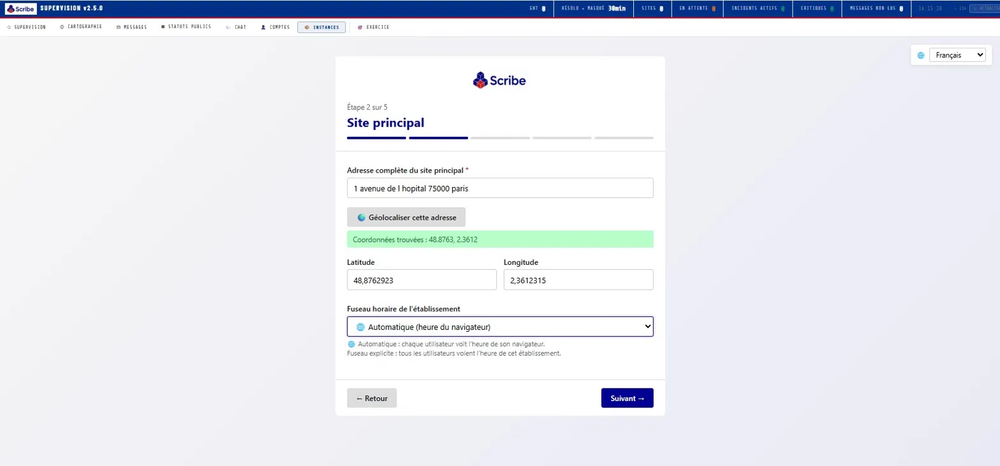

**Étape 3 — Compte administrateur**

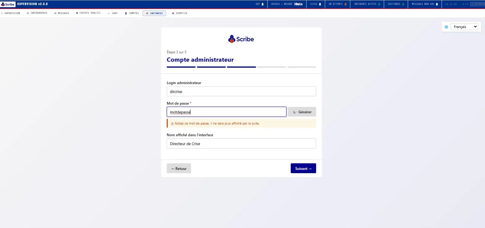

**Étape 4 — Intelligence artificielle (optionnelle)**

SCRIBE fonctionne sans IA. Si vous souhaitez activer l'analyse de crise et l'aide à la décision, plusieurs fournisseurs sont supportés (Albert — IA souveraine du gouvernement français, OpenAI, Anthropic, Mistral, Ollama).

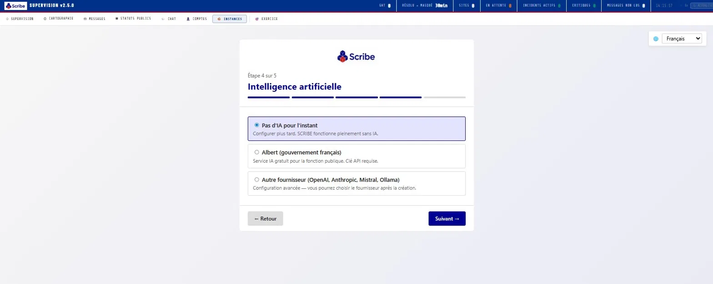

**Étape 5 — Récapitulatif et création**

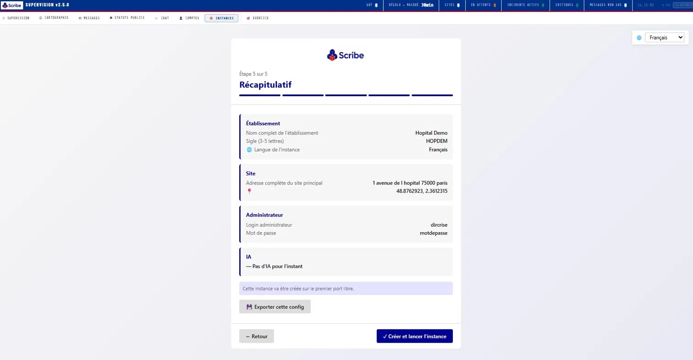

### Pilotage multi-instances

Une seule interface pour lancer, configurer et superviser plusieurs établissements. Chaque instance a sa propre base de données isolée.

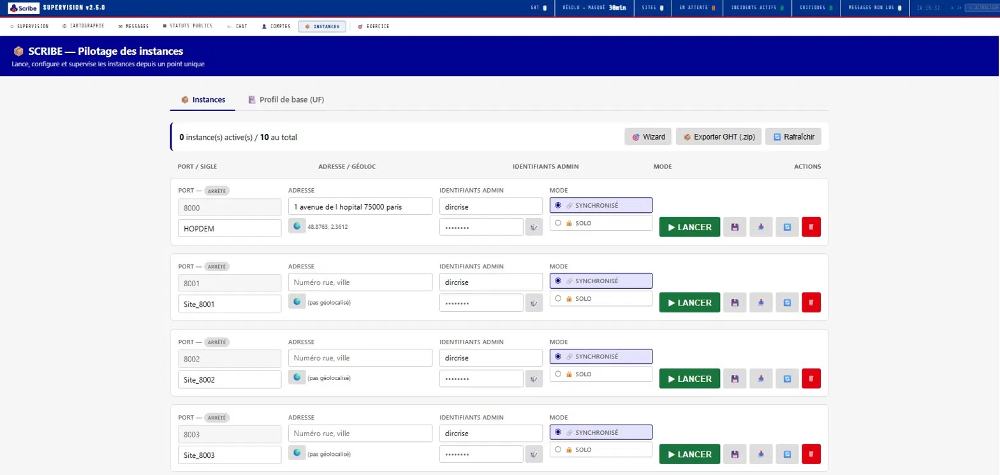

### Tableau de bord opérationnel

Vue de synthèse : incidents actifs, capacité globale, transferts en cours, messagerie, main courante des dernières heures.

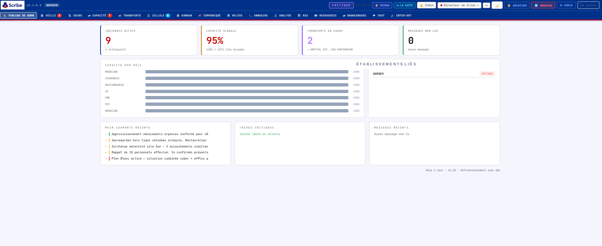

### VEILLE — Main courante des incidents

Déclaration d'incident structurée : type (CYBER / SANITAIRE / MIXTE), niveau d'urgence (1 VEILLE → 4 CRITIQUE), impact fonctionnel, jalons de résolution. Carte des incidents géolocalisés.

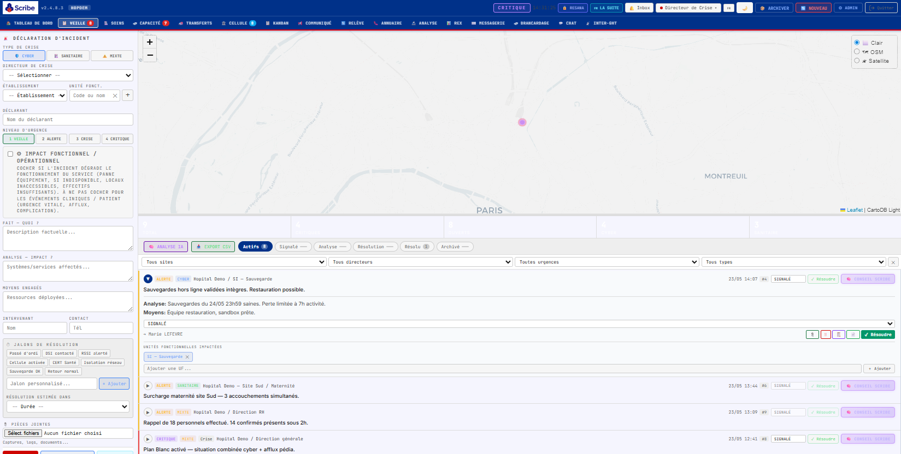

### SOINS — Cartographie de situation

Vue d'ensemble des services transverses (Sécurité physique, Logistique, DPI/SIH, Messagerie, Biologie, Restauration, Blanchisserie, Pharmacie) et des services métiers (Urgences, Réa, Bloc, Médecine, Chirurgie, Pédiatrie, Soins critiques, etc.). Statut OK / Dégradé / Critique par service.

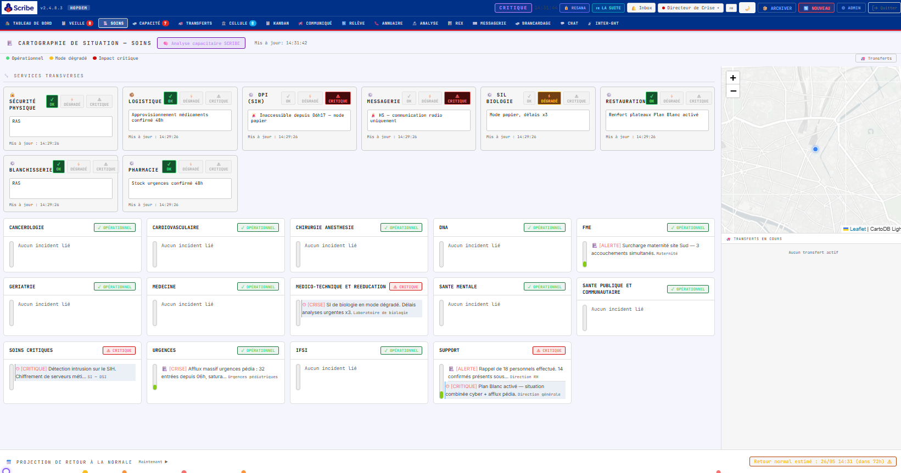

### CAPACITÉ — Suivi des lits temps réel

Déclaration par service et par pôle des lits disponibles (H / F / Indifférent), de la tension lits/RH, du statut opérationnel. Auto-remplissage du déclarant. Filtre "lits > 0 uniquement".

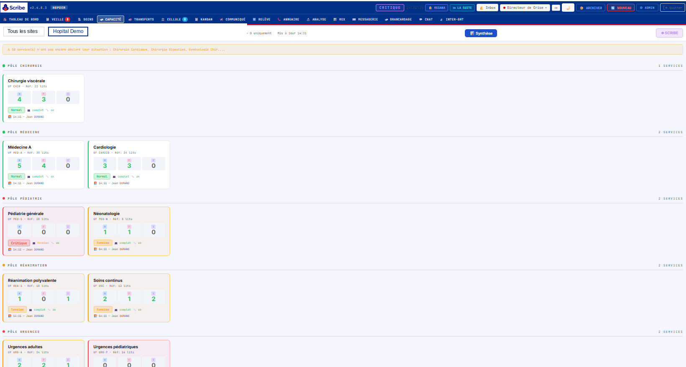

### TRANSFERTS — Gestion des patients inter-établissements

Kanban des transferts (En préparation / En cours / Arrivé / Annulé). Suivi de la trajectoire ambulance via OSRM. Justification obligatoire pour tout retour en arrière. **Les données nominatives ne remontent jamais au collecteur territorial** (HDS/RGPD).

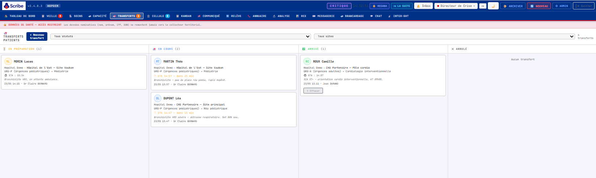

### CELLULE — Salle de crise

Registre des présences (Direction, ARS, Préfecture, SAMU, SDIS, DSI, RSSI, médecin coordinateur, etc.). Chronologie décisionnelle horodatée et signée.

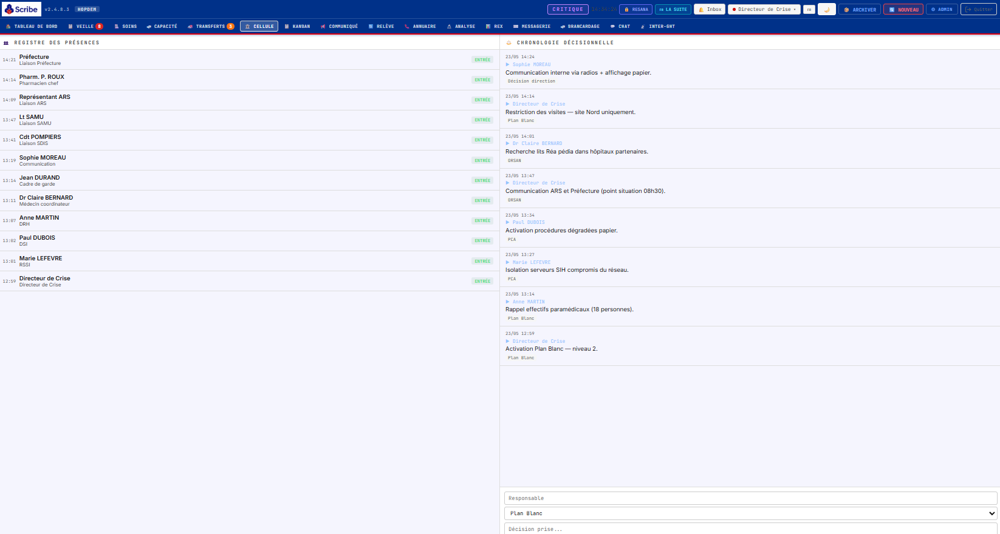

### COMMUNIQUÉ — Statut public

Page publique opposable accessible via QR code. Statuts des SI (messagerie, DPI, imagerie, téléphonie, VPN, applications métier) et de la prise en charge patients (urgences, blocs, consultations, hospitalisations).

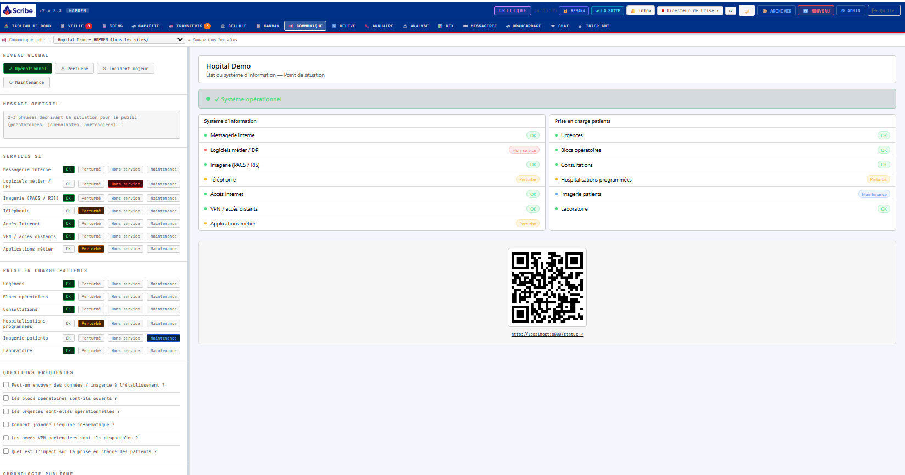

### RELÈVE — Passation de consignes

Journal des consignes pour la prochaine équipe de garde. Accusé de réception nominatif.

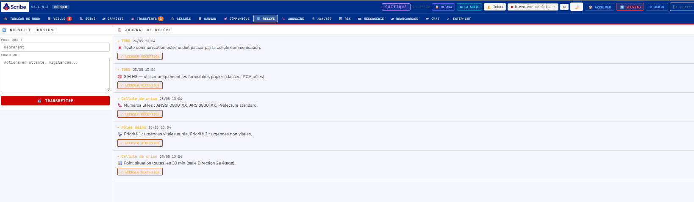

### ANNUAIRE — Répertoire de crise

Numéros de téléphonie nominale et de secours, contacts messagerie, par service et organisme partenaire (CERT Santé, ANSSI, ARS, Préfecture, SDIS, SAMU).

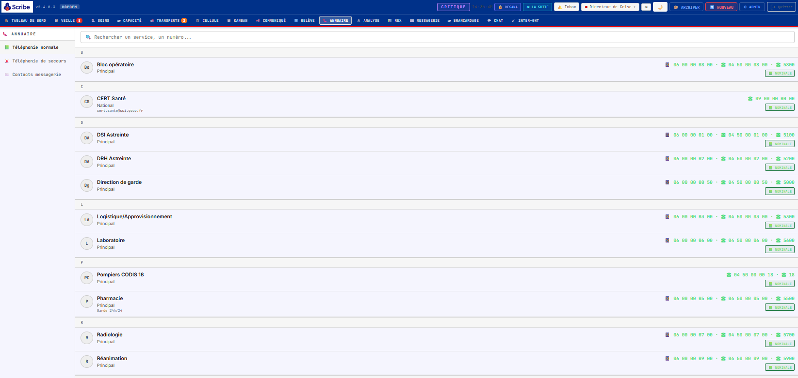

### ANALYSE — Debriefing post-crise

Import d'une archive de gestion de crise (.zip exportée depuis SCRIBE) pour rejeu, analyse, et identification des axes d'amélioration. Comparaison possible entre deux gestions d'un même scénario.

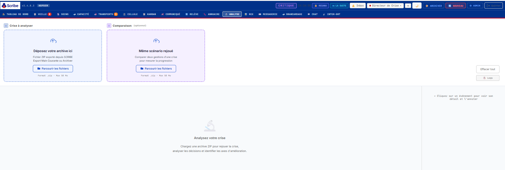

### BRANCARDAGE — Demandes de transport interne

Gestion des demandes de brancardage par référence patient, priorité, mode de transport, UF origine et destination.

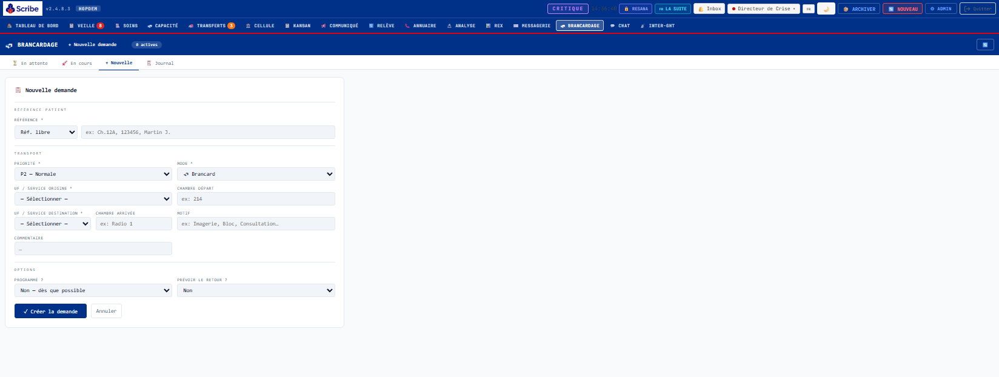

### MODE EXERCICE — Entraînement multi-sites

SCRIBE intègre un mode exercice complet pour l'entraînement des cellules de crise, totalement isolé de la production (bases de données séparées).

**Supervision exercice** — pilotage de 10 instances joueurs (ports 8660-8669) :

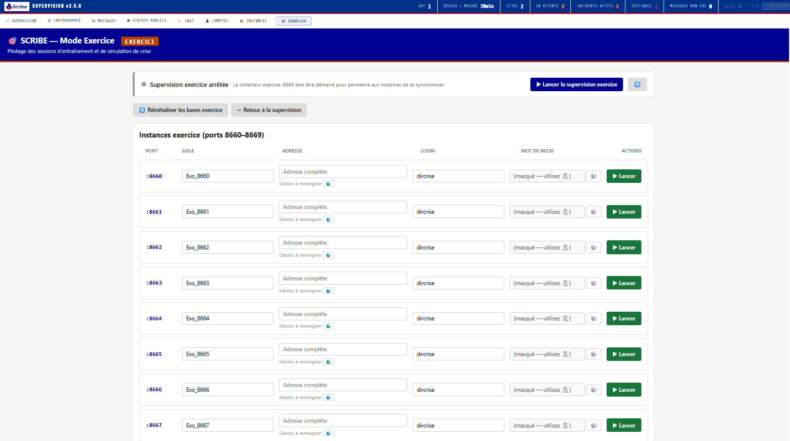

**Console animateur** — vue d'ensemble des sites participants et statuts publics :

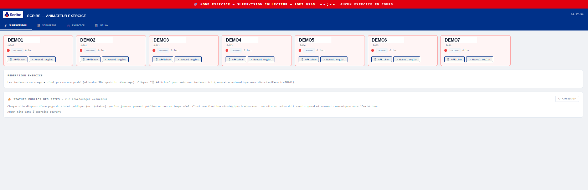

**Bibliothèque de scénarios** — 5 scénarios prêts à l'emploi (cyberattaque ransomware, panne électrique + cyber, afflux massif victimes, crise obstétricale, tension capacitaire) + création de scénarios personnalisés via formulaire ou XML. Génération assistée par IA possible.

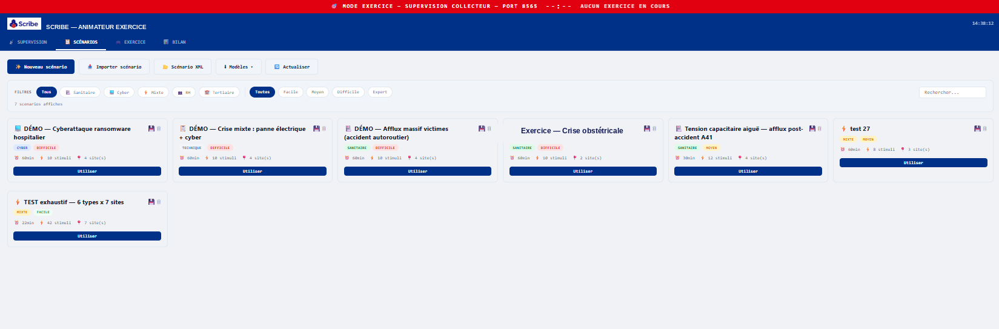

**Contrôle de l'exercice** — démarrer / pause / arrêter, injecter un stimulus manuel, suivre le temps écoulé et le compteur de stimuli injectés :

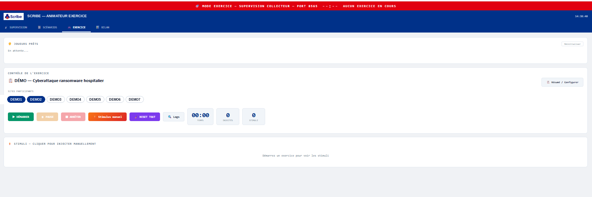

**Timeline de stimuli** — activation/désactivation des stimuli prévus dans le scénario (alertes SOC, demandes ANSSI/ARS, décisions stratégiques attendues, etc.) :

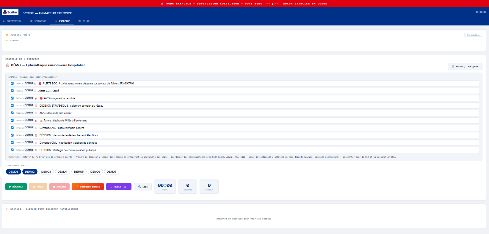

**Stimulus manuel** — injection à la volée d'un événement de déstabilisation pour tester la réactivité des joueurs :

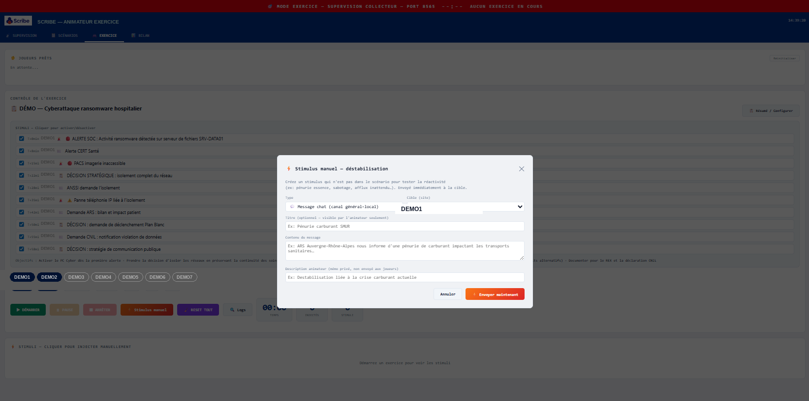

**Bilan temps réel** — état de chaque site joueur (en ligne, incidents ouverts, critiques, cyber, transferts), génération automatique d'un rapport HTML autonome en fin d'exercice (chronologie, KPIs, radar de compétences) :

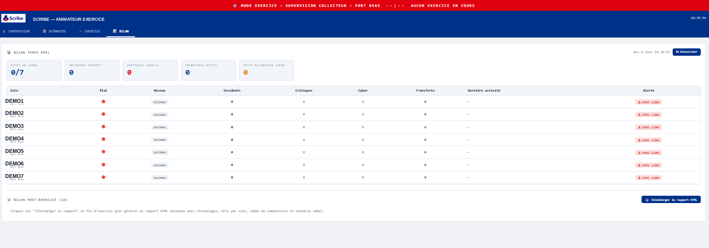

---

## Fonctionnalités

### 📋 Gestion de crise

- **Main courante incidents** (CYBER / SANITAIRE / MIXTE, 4 niveaux d'urgence)
- **Jalons de résolution** prédéfinis et personnalisables (DSI contacté, CERT Santé, Isolation réseau, Sauvegarde validée…)
- **Cellule de crise** : présences horodatées + chronologie décisionnelle
- **Kanban opérationnel** Backlog / En cours / En attente / Terminé, avec assignation et priorité
- **Relève de garde** numérique avec accusés de réception
- **Communiqué public** opposable avec QR code et page `/status`
- **Annuaire de crise** : téléphonie nominale + secours, partenaires institutionnels
- **REX** (retour d'expérience) post-crise avec analyse IA

### 🛏️ Suivi capacitaire

- **Déclarations capacitaires** par UF/service/pôle, avec lits H/F/I, tension lits/RH, statut opérationnel
- **Référentiel UF** modifiable via interface admin ou import Excel
- **Vue synthétique** par pôle et par site
- **Configuration des sites secondaires** et services transverses
- **Filtrage** "lits > 0 uniquement" pour focaliser sur les services actifs

### 🚑 Transferts patients

- **Kanban des transferts** En préparation / En cours / Arrivé / Annulé
- **Trajectoire ambulance** calculée via OSRM (sans clé API)
- **Recul de transfert** avec motif obligatoire et tracé
- **Données nominatives strictement locales** — jamais remontées au collecteur

### 📡 Coordination territoriale

- **Collecteur territorial** centralisant la situation de plusieurs établissements
- **Push automatique** toutes les 30 secondes
- **Demandes inter-établissements** (lits, équipe, matériel) avec accusé de réception
- **Messagerie inter-établissements**
- **Statuts publics** des sites — vue territoriale en temps réel
- **Cartographie** des sites avec niveau de crise

### 🎓 Mode exercice

- **10 instances joueurs** isolées (ports 8660-8669)
- **Console animateur** dédiée (port 6565)
- **5 scénarios prêts à l'emploi** : cyberattaque ransomware, panne électrique + cyber, afflux massif victimes, crise obstétricale multi-sites, tension capacitaire
- **Création de scénarios** via formulaire, XML ou génération IA assistée
- **Stimuli horodatés** activables/désactivables à la volée
- **Stimulus manuel** pour déstabilisation à la volée
- **Bilan temps réel** : statut de chaque joueur, incidents ouverts, transferts
- **Rapport HTML autonome** post-exercice (chronologie, KPIs, radar de compétences, scénario idéal vs réalisé)
- **Bases de données isolées** — aucune pollution de la production

### 🤖 Intelligence artificielle (optionnelle)

SCRIBE fonctionne **sans IA**. Si activée, l'IA est utilisée pour :

- Analyse capacitaire (suggestions de redéploiement)
- Génération de scénarios d'exercice
- Aide à la décision en cellule de crise
- Debriefing post-crise

**Fournisseurs supportés :**

- **Albert** — IA souveraine du gouvernement français (gratuite pour la fonction publique)
- **OpenAI** (GPT-4, GPT-3.5)
- **Anthropic** (Claude)
- **Mistral**
- **Ollama** — modèles locaux (Llama, Mistral, Qwen…)
- **Google Gemini**
- **Compatible OpenAI** (Groq, Together, etc.)

### 🌐 Multilingue

Interface disponible en **8 langues** : Français, English, Deutsch, Español, Italiano, Nederlands, Polski, Português.

### 🌍 Multi-fuseaux

16 fuseaux IANA pré-configurés couvrant la métropole, les DOM-TOM (Guadeloupe, Martinique, Guyane, La Réunion, Mayotte, Polynésie, Nouvelle-Calédonie, Saint-Pierre-et-Miquelon, Wallis-et-Futuna), et saisie libre pour tout autre fuseau. Chaque utilisateur voit les horodatages dans l'heure locale de son établissement.

### 🔐 Sécurité et conformité

- **Authentification** bcrypt + JWT, migration transparente depuis SHA-256
- **MFA TOTP** disponible (Google Authenticator, Aegis, etc.)
- **Rate limiting** sur les endpoints sensibles
- **Headers HTTP** sécurisés, CORS restreint
- **Notifications Web Push** (VAPID) optionnelles
- **Conçu pour les contraintes HDS et RGPD** — pas d'audit officiel à ce stade
- **Données nominatives patients** strictement locales, jamais remontées vers le collecteur
- **Pas de cloud, pas de LDAP**, fonctionne en réseau isolé

---

## Démarrage rapide

### Mode démo (5 minutes)

```bash
# Linux / macOS
git clone https://github.com/nocomp/scribe.git
cd scribe
pip install -r requirements.txt
bash lancer_scribe.sh
# → http://localhost:9000
# Suivre le wizard d'onboarding
```

```bat
:: Windows
LANCER_SCRIBE.bat
:: → http://localhost:9000
```

```bash
# Docker
docker compose up -d
# → http://localhost:9000
```

Une fois l'instance créée via le wizard, l'interface est accessible sur le port assigné (par défaut 8000) avec les identifiants choisis à l'étape 3.

### Import d'une configuration existante

Si vous disposez déjà d'un fichier de configuration Excel (`SCRIBE_config_etablissement.xlsx`), choisissez "Importer une config existante" au démarrage du wizard.

### Déploiement multi-établissements

Pour un déploiement GHT complet (plusieurs établissements + collecteur territorial), choisissez "Déployer un GHT complet" et importez le ZIP contenant les configurations.

---

## Stack technique

| Composant | Technologie |
|---|---|
| Backend | FastAPI (Python 3.11+) |
| ORM | SQLAlchemy 2.x |
| Base de données | SQLite (une DB par instance) |
| Frontend | Vanilla JS (SPA) |
| Cartographie | Leaflet.js + CartoDB Light |
| Routing ambulances | OSRM (gratuit, sans clé) |
| IA (optionnel) | Albert / OpenAI / Anthropic / Mistral / Ollama / Gemini |
| Authentification | bcrypt + JWT |
| MFA | pyotp (TOTP) |
| Notifications Push | pywebpush (VAPID) |
| Design system | DSFR (Système de Design de l'État français) |
| Déploiement | Linux systemd, Docker, Windows |

### Architecture

```
┌──────────────────────────────────────────────────────────────┐
│  MASTER (port 9000)                                          │
│  Pilotage instances + Collecteur territorial + Mode exercice │
└────────────┬─────────────────────────────────────────────────┘
             │
       ┌─────┴─────┬─────────┬─────────┬─────────┐
       ▼           ▼         ▼         ▼         ▼
   ┌────────┐ ┌────────┐ ┌────────┐ ┌────────┐ ┌──────────┐
   │Inst.1  │ │Inst.2  │ │Inst.3  │ │  ...   │ │Exercice  │
   │:8000   │ │:8001   │ │:8002   │ │        │ │:8660-9   │
   │  DB    │ │  DB    │ │  DB    │ │        │ │DB isolées│
   └────────┘ └────────┘ └────────┘ └────────┘ └──────────┘
```

Chaque instance a sa propre base SQLite stockée sous `data/instances/<SIGLE>/scribe.db`. Le master lance les instances comme sous-processus Python et expose une interface unique pour les superviser.

---

## Pour les développeurs

### Structure du projet

```
scribe_v2500/
├── main.py                       # Entrée FastAPI d'une instance
├── lancer_scribe.sh / .bat       # Lancement du master
├── app/
│   ├── models.py                 # 22+ modèles SQLAlchemy
│   ├── database.py
│   ├── api/                      # Routes API (v140.py principal)
│   ├── static/index.html         # SPA frontend
│   └── lang/                     # FR/EN/DE/ES/IT/NL/PL/PT
├── plugins/                      # 17 plugins fonctionnels
│   ├── albert/                   # IA Albert
│   ├── annuaire/
│   ├── brancardage/
│   ├── capacite/
│   ├── cellule/
│   ├── chat/
│   ├── communique/
│   ├── exercice/                 # Mode exercice complet
│   ├── federation/               # Push vers collecteur territorial
│   ├── inter_ght/                # Coordination inter-établissements
│   ├── messagerie/
│   ├── notifications/            # Web Push
│   ├── rapport/                  # Archivage ZIP
│   ├── releve/
│   ├── rex/
│   ├── transferts/
│   └── tuteur/                   # Aide contextuelle
├── master/                       # UI master + gestion instances
│   ├── master_routes.py
│   ├── instances_manager.py
│   ├── onboarding.html           # Wizard 5 étapes
│   ├── instances.html
│   └── exercice.html
├── collecteur/                   # Collecteur territorial (port 9000)
├── collecteur_exercice/          # Collecteur exercice (port 6565)
├── scenarios/                    # 5 scénarios JSON + XML template
├── core/                         # Plugin loader, admin plugins
└── data/instances/<SIGLE>/       # DBs par instance (créées au runtime)
```

### Installer en dev

```bash
git clone https://github.com/nocomp/scribe.git
cd scribe
python -m venv venv
source venv/bin/activate         # Windows: venv\Scripts\activate
pip install -r requirements.txt
bash lancer_scribe.sh
```

### Contribuer

- **Issues** : https://github.com/nocomp/scribe/issues
- **Pull requests** bienvenues
- Respecter la séparation **données nominatives = local uniquement**
- Préserver les contraintes existantes en mode dégradé (papier, mode mobile, etc.)

### Tests

```bash
# Validation syntaxe Python
python -m py_compile $(find . -name "*.py" -not -path "./venv/*")

# Lancer une instance
bash lancer_scribe.sh
```

---

## Conformité

- **Open source AGPL-3.0** — toute modification déployée doit être publiée
- **Conçu pour les contraintes HDS et RGPD** (pas d'audit officiel à ce stade)
- **Données patients nominatives** restent strictement locales (ne remontent jamais au collecteur)
- **Pas de cloud externe requis** — fonctionne en air gap
- **Authentification forte** (bcrypt + JWT, MFA TOTP optionnel)

---

## Contact

- **GitHub** : https://github.com/nocomp/scribe
- **Issues** : https://github.com/nocomp/scribe/issues
- **Email** : nocomp@gmail.com

---

## 🇬🇧 English version

### What is SCRIBE?

**SCRIBE** is an open-source platform for **hospital crisis management** and **real-time capacity tracking**. It provides a digital incident log, inter-facility coordination, and a complete exercise mode for crisis cell training.

**Designed for dual use:**

- **Steady-state mode** — daily tracking of bed/HR/equipment capacity, declarations by service managers, dashboard for nursing and HR directors.
- **Crisis mode** — incident log, crisis cell, operational kanban, public bulletins, patient transfers with OSRM routing, territorial coordination.

**Built for non-technical users** — nursing managers, directors, crisis managers, CISOs. No cloud, no LDAP required, runs on isolated networks.

### Who is it for?

- **Public or private hospitals** looking for a sovereign digital incident log for their business continuity / disaster recovery plan.
- **Multi-site healthcare groups** for territorial coordination.
- **Crisis exercise trainers** — the exercise mode orchestrates multi-site drills with real-time scenario injection.
- **Multi-timezone organizations** — native support for 16 IANA timezones + free-form entry.

### Screenshots

See the French version above — captures and feature walkthrough are language-agnostic.

### Features

#### 📋 Crisis management

- **Incident log** (CYBER / HEALTHCARE / MIXED, 4 urgency levels)
- **Resolution milestones** predefined and customizable
- **Crisis cell**: timestamped attendance + decision chronology
- **Operational kanban** Backlog / In progress / Pending / Done
- **Shift handover** with acknowledgments
- **Public bulletin** with QR code and `/status` page
- **Crisis directory**: regular + backup phone lines, institutional partners
- **Post-crisis feedback (REX)** with AI analysis

#### 🛏️ Capacity tracking

- **Capacity declarations** by functional unit / service / pole
- **Beds available** (Male / Female / Mixed)
- **Tension status** (beds, HR, operational)
- **Editable UF reference** via admin UI or Excel import
- **Synthetic view** by pole and by site

#### 🚑 Patient transfers

- **Transfer kanban** (In preparation / In progress / Arrived / Cancelled)
- **Ambulance routing** via OSRM (no API key required)
- **Transfer rollback** with mandatory reason and audit trail
- **Patient-identifying data strictly local** — never sent to territorial collector

#### 📡 Territorial coordination

- **Territorial collector** centralizing the situation of multiple facilities
- **Automatic push** every 30 seconds
- **Inter-facility requests** (beds, staff, equipment)
- **Inter-facility messaging**
- **Public site status** — real-time territorial view
- **Map view** of sites with crisis level

#### 🎓 Exercise mode

- **10 isolated player instances** (ports 8660-8669)
- **Dedicated facilitator console** (port 6565)
- **5 ready-to-use scenarios**: ransomware cyberattack, power outage + cyber, mass casualty incident, multi-site obstetric crisis, capacity tension
- **Scenario creation** via form, XML, or AI-assisted generation
- **Timestamped stimuli** activatable on the fly
- **Manual stimulus** for ad-hoc destabilization
- **Real-time dashboard**: each player's status, open incidents, transfers
- **Standalone HTML report** post-exercise (chronology, KPIs, competency radar)
- **Isolated databases** — no impact on production

#### 🤖 AI (optional)

SCRIBE works **without AI**. If enabled, AI is used for capacity analysis, scenario generation, decision support, and post-crisis debriefing.

**Supported providers:**

- **Albert** — French government sovereign AI (free for public sector)
- **OpenAI** (GPT-4, GPT-3.5)
- **Anthropic** (Claude)
- **Mistral**
- **Ollama** — local models (Llama, Mistral, Qwen…)
- **Google Gemini**
- **OpenAI-compatible** (Groq, Together, etc.)

#### 🌐 Multilingual

UI available in **8 languages**: French, English, German, Spanish, Italian, Dutch, Polish, Portuguese.

#### 🌍 Multi-timezone

16 pre-configured IANA timezones covering metropolitan France, French overseas territories, plus free-form entry for any other zone.

#### 🔐 Security & compliance

- **Authentication** bcrypt + JWT, transparent migration from SHA-256
- **MFA TOTP** available (Google Authenticator, Aegis, etc.)
- **Rate limiting** on sensitive endpoints
- **Hardened HTTP headers**, restricted CORS
- **Web Push notifications** (VAPID) optional
- **Designed for HDS and GDPR constraints** — no official audit yet
- **Patient-identifying data** strictly local, never sent to collector
- **No cloud, no LDAP**, works on isolated networks

### Quick start

```bash
# Linux / macOS
git clone https://github.com/nocomp/scribe.git
cd scribe
pip install -r requirements.txt
bash lancer_scribe.sh
# → http://localhost:9000
# Follow the onboarding wizard
```

```bat
:: Windows
LANCER_SCRIBE.bat
:: → http://localhost:9000
```

```bash
# Docker
docker compose up -d
# → http://localhost:9000
```

### Tech stack

| Component | Technology |
|---|---|
| Backend | FastAPI (Python 3.11+) |
| ORM | SQLAlchemy 2.x |
| Database | SQLite (one DB per instance) |
| Frontend | Vanilla JS (SPA) |
| Maps | Leaflet.js + CartoDB Light |
| Ambulance routing | OSRM (free, no key) |
| AI (optional) | Albert / OpenAI / Anthropic / Mistral / Ollama / Gemini |
| Authentication | bcrypt + JWT |
| MFA | pyotp (TOTP) |
| Push notifications | pywebpush (VAPID) |
| Design system | DSFR (French government design system) |
| Deployment | Linux systemd, Docker, Windows |

### Architecture

```
┌──────────────────────────────────────────────────────────────┐
│  MASTER (port 9000)                                          │
│  Instance management + Territorial collector + Exercise mode │
└────────────┬─────────────────────────────────────────────────┘
             │
       ┌─────┴─────┬─────────┬─────────┬─────────┐
       ▼           ▼         ▼         ▼         ▼
   ┌────────┐ ┌────────┐ ┌────────┐ ┌────────┐ ┌──────────┐
   │Inst.1  │ │Inst.2  │ │Inst.3  │ │  ...   │ │Exercise  │
   │:8000   │ │:8001   │ │:8002   │ │        │ │:8660-9   │
   │  DB    │ │  DB    │ │  DB    │ │        │ │isolated  │
   └────────┘ └────────┘ └────────┘ └────────┘ └──────────┘
```

### For developers

See the French project structure above. To install in dev:

```bash
git clone https://github.com/nocomp/scribe.git
cd scribe
python -m venv venv
source venv/bin/activate         # Windows: venv\Scripts\activate
pip install -r requirements.txt
bash lancer_scribe.sh
```

### Contributing

- **Issues**: https://github.com/nocomp/scribe/issues
- Pull requests welcome
- Respect the principle: **patient-identifying data = local only**
- Preserve existing degraded-mode constraints (paper backup, mobile, etc.)

### Compliance

- **Open source AGPL-3.0** — any deployed modification must be published
- **Designed for HDS and GDPR constraints** (no official audit yet)
- **Patient-identifying data** stays strictly local (never sent to collector)
- **No external cloud required** — works air-gapped
- **Strong authentication** (bcrypt + JWT, optional MFA TOTP)

### Contact

- **GitHub**: https://github.com/nocomp/scribe
- **Issues**: https://github.com/nocomp/scribe/issues
- **Email**: nocomp@gmail.com

---

## License

GNU Affero General Public License v3.0 — see [LICENSE](LICENSE).

SCRIBE is free software: you can redistribute it and/or modify it under the terms of the GNU Affero General Public License as published by the Free Software Foundation, version 3 of the License.

This program is distributed in the hope that it will be useful, but WITHOUT ANY WARRANTY; without even the implied warranty of MERCHANTABILITY or FITNESS FOR A PARTICULAR PURPOSE. See the GNU Affero General Public License for more details.
