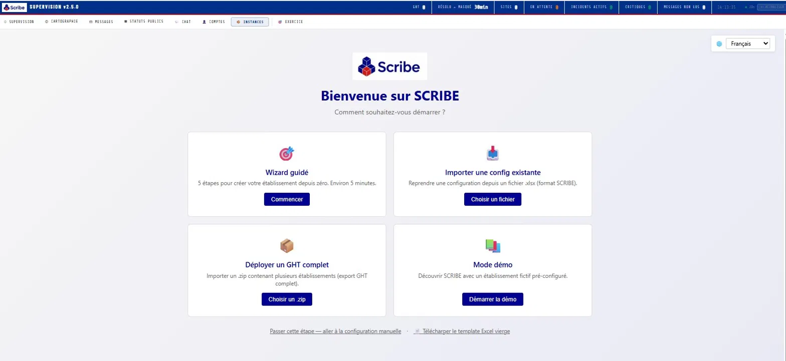
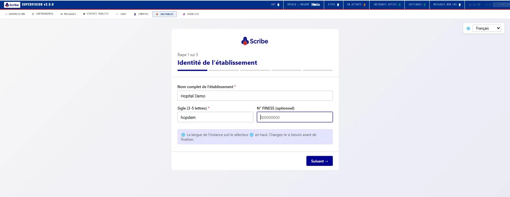

<div align="center">



# 🏥 SCRIBE
🇫🇷 Version française
⬇️ Faites défiler pour la version française complète ⬇️
### Open-Source Hospital Crisis Management Platform

**Multi-site · Multi-language · On-premise · AGPL-3.0**


[**Quick Start**](#-quick-start) · [**Features**](#%EF%B8%8F-features) · [**Screenshots**](#-screenshots) · [**Architecture**](#%EF%B8%8F-architecture) · [**Contributing**](#-contributing) · [🇫🇷 **Version française**](#-version-française)

</div>

---

## 🇬🇧 English

> **In one sentence:** SCRIBE turns a shared Word document for crisis management into a real platform — fast, traced, multi-site, and free.

### Why SCRIBE?

When a major incident hits a hospital — a cyberattack, a mass casualty event, an epidemic peak, a Major Incident Plan activation — crisis directors are often forced to coordinate with the only tool they have at hand: a shared Word document.

No real-time traceability. No reliable timestamps. No capacity overview. No territorial coordination. Just a document everyone edits at the same time, hoping nothing gets lost.

**SCRIBE was built to change that.**

It is a complete, mature, ready-to-deploy platform that gives crisis directors, CISOs, medical coordinators, and supervisors the structured information they need — without requiring a cloud, a vendor contract, or a six-month integration project.

### 🎯 Built for healthcare facilities of every size

From large teaching hospitals to community clinics. From a single facility to a territorial network coordinated by a regional health agency. SCRIBE scales down as gracefully as it scales up.

### 🌍 Multilingual. European. Sovereign.

- **Multilingual interface** (French, English, Italian, Spanish — more on the way)
- **16 pre-configured timezones**, from Paris to Papeete, via Réunion, Martinique, and Guadeloupe
- **100% on-premise** — patient data never leaves the facility
- **Designed for European GDPR and healthcare data sovereignty constraints**

### ✨ And freely given. Like the smile that greets you when you enter a hospital.

Open source under AGPL-3.0. No commercial license, no enterprise edition, no premium tier. The whole platform, for everyone, forever.

---

## 📸 Screenshots

<div align="center">

### Guided wizard — your facility configured in 5 minutes





### The platform in action


</div>

---

## ⚙️ Features

### Crisis logbook

- Real-time structured event log, multi-user, timestamped to the second
- Categorized incidents (CYBER, SANITARY, MIXED) with urgency levels
- Filterable views by site, ward, time window, type, resolution status
- Editable in-place, full audit trail

### Capacity tracking

- Capacity declarations per ward, by point-in-time (morning, midday, afternoon, evening)
- Tension levels: **normal · tension · critical**
- Visual grid showing bed occupancy across all wards in real time
- Configurable thresholds, automatic alert when thresholds are crossed
- Filter out wards with no beds, auto-fill of the declaring supervisor

### Inter-facility patient transfers

- Workflow: **EN_PREPARATION → EN_COURS → ARRIVE**
- Live ambulance routing on a map (OSRM)
- ETA in the recipient facility timezone
- Mandatory reason for any status regression (e.g. ARRIVE → EN_COURS)
- Full status history tracked in `historique_json`
- Push to territorial collector for cross-site visibility

### Crisis cell management

- Decision chronology with regulatory basis (Plan Blanc, ORSAN, PCA)
- Attendance log: who's in the crisis room, role, arrival timestamp
- Directives broadcast to staff with read receipt
- Autocomplete from configured stakeholder roster + live history

### Territorial supervision

- Master collector aggregating multiple facilities
- Real-time view of regional status (incidents, capacity, transfers, alerts)
- Designed for regional health agencies and crisis coordination cells
- Patient data **stays in each facility** — only aggregated indicators reach the collector

### Drill mode

- Built-in scenario injector — train without touching production data
- Animator console to play crisis scenarios in real time
- Isolated databases per drill instance
- Replayable scenarios in JSON

### Administration

- User management (roles: admin, director, observer)
- Bulk user import via Excel
- Unit of Work (UF) management via the UI — activate, deactivate, edit, add
- Excel-driven facility configuration (units, capacity, directory, emergency phone numbers)
- Bilingual UI throughout

### Security

- Bcrypt password storage with rate-limited login
- Forced password change on first login (configurable)
- JWT-based session tokens
- Restrictive CORS and Content Security Policy
- Secret key in environment variable
- All security advisories follow a coordinated disclosure policy (see [SECURITY.md](SECURITY.md))

---

## 🚀 Quick Start

### Requirements

- Python 3.10 or higher
- 200 MB free disk space
- Modern web browser (Firefox, Chrome, Edge, Safari)

### Linux / Mac

```bash
# 1. Download the latest release
wget https://github.com/nocomp/scribe/releases/latest/download/scribe_v2500_master_public.zip

# 2. Unzip
unzip scribe_v2500_master_public.zip
cd scribe_v2500

# 3. Launch
./lancer_scribe.sh

# 4. Open in your browser
open http://localhost:9000

# 5. Login
#    Username: supervision
#    Password: changeme  (change immediately on first login)
```

### Windows

1. Download `scribe_v2500_master_public.zip` from the [latest release](https://github.com/nocomp/scribe/releases/latest)
2. Right-click → **Extract All**
3. Double-click `LANCER_SCRIBE.bat`
4. Open `http://localhost:9000` in your browser
5. Login with `supervision` / `changeme` (and change the password immediately)

### First steps after install

Once logged in, follow the **onboarding wizard** (~5 minutes):

1. Choose your start mode (guided wizard, Excel import, demo mode, or full territorial network deployment)
2. Enter your facility identity (name, sigla, FINESS code, language)
3. Pick your timezone (16 IANA timezones pre-configured + free entry)
4. Configure your branding and AI provider (optional)
5. Review and create the instance

Your instance is now live on its own port (8000, 8001, ...) and ready to use.

### Reset to a clean state

If you need to wipe everything and start from scratch:

```bash
./lancer_scribe.sh --reset    # Linux/Mac
LANCER_SCRIBE.bat --reset     # Windows
```

This clears the onboarding flag, removes all instance databases, and lets you re-run the wizard cleanly.

---

## 🏗️ Architecture

### Stack

| Layer | Technology |
|-------|-----------|
| Backend | FastAPI (Python) |
| ORM | SQLAlchemy |
| Database | SQLite (one DB per instance) |
| Frontend | Vanilla JavaScript (SPA) |
| Cartography | Leaflet.js + OSRM (ambulance routing) |
| Tile provider | CartoDB Light |
| AI (optional) | Albert (French government LLM) |
| Design system | DSFR (Système de Design de l'État Français) |

### Deployment topology

```
                    ┌─────────────────────────────────┐
                    │  Master / Collector  :9000      │
                    │  - Onboarding wizard            │
                    │  - Territorial supervision      │
                    │  - Multi-facility aggregator    │
                    └────────────┬────────────────────┘
                                 │
              ┌──────────────────┼──────────────────┐
              │                  │                  │
        ┌─────▼─────┐      ┌─────▼─────┐      ┌─────▼─────┐
        │ Facility A│      │ Facility B│      │ Facility C│
        │   :8000   │      │   :8001   │      │   :8002   │
        │           │      │           │      │           │
        │ Own SQLite│      │ Own SQLite│      │ Own SQLite│
        │ DB        │      │ DB        │      │ DB        │
        └───────────┘      └───────────┘      └───────────┘
        Patient data       Patient data       Patient data
        STAYS LOCAL        STAYS LOCAL        STAYS LOCAL
```

Each facility runs an independent SCRIBE instance with its own database. The master collector aggregates only **non-nominative indicators** (incidents, capacity tension, transfer counts) — never patient names, identifiers, or medical data.

### Why this matters for compliance

- **GDPR**: patient data is processed only by the local facility, on its own infrastructure
- **HDS** (French Health Data Hosting): no cloud dependency, no third-party data processor
- **Sovereignty**: 100% on-premise, your data, your servers, your rules

---

## 🛠️ For Developers

### Installation from source

```bash
git clone https://github.com/nocomp/scribe.git
cd scribe
pip install -r requirements.txt
python collecteur/collecteur.py
```

### Project structure

```
scribe/
├── main.py                      # FastAPI entry point (per-facility instance)
├── app/
│   ├── models.py                # SQLAlchemy models (22 tables)
│   ├── database.py              # DB connection
│   ├── api/                     # REST routes
│   │   ├── v140.py              # Main app routes
│   │   ├── admin_uf.py          # UF administration
│   │   ├── cartographie.py      # Mapping and geolocation
│   │   └── ...
│   └── static/                  # SPA frontend
│       ├── index.html
│       └── js/scribe.js
├── master/
│   ├── master_routes.py         # Master routes (onboarding, instance management)
│   ├── instances_manager.py     # Sub-process orchestration
│   ├── onboarding.html          # Wizard UI
│   └── instances.html           # Instance management UI
├── collecteur/
│   ├── collecteur.py            # Territorial collector (:9000)
│   └── collecteur_admin.json    # Admin token (auto-generated on first launch)
├── plugins/                     # Optional plugins (chat, exercise, etc.)
└── data/instances/<SIGLE>/      # Per-instance databases
```

### Configuration

Each facility's configuration lives in an XML file generated by the wizard. The wizard accepts an Excel template (`SCRIBE_config_etablissement.xlsx`) to bulk-load:

- Units of Work (UF) with their ward, pole, and bed counts
- Capacity reference
- Phone directory (regular and emergency)
- Cross-functional services (security, IT, logistics, pharmacy, etc.)

### Contributing

Issues and pull requests welcome. See [CONTRIBUTING.md](CONTRIBUTING.md) for guidelines.

Good first issues are tagged with [`good first issue`](https://github.com/nocomp/scribe/labels/good%20first%20issue).

Translation contributions are especially welcome — see the `locales/` folder.

---

## 🗺️ Roadmap

### Released ✅

- **v2.5.0** — First public release (May 2026)
- v2.4.x — Onboarding wizard, capacity tension levels, transfer history
- v2.3.x — Drill module, exercise scenarios
- v2.2.x — Territorial collector, multi-site aggregation

### In progress 🚧

- Mobile-first responsive views
- Additional language packs (DE, NL, PT)
- LDAP / Active Directory integration
- FHIR-compatible data export

### Planned 📋

- Long-term: inter-facility messaging across regions
- Long-term: ministerial supervision dashboard
- Long-term: proactive AI decision support
- Long-term: institutional memory and decision pattern learning

---

## 🤝 Contributing

SCRIBE is an open project. Contributions are welcome from healthcare professionals, developers, translators, and anyone interested in hospital resilience.

- **Found a bug?** Open an [issue](https://github.com/nocomp/scribe/issues/new?template=bug_report.md)
- **Have an idea?** Open a [discussion](https://github.com/nocomp/scribe/discussions)
- **Want to translate?** Fork `locales/` and submit a PR
- **Want to deploy in your facility?** Reach out — happy to help

See [CONTRIBUTING.md](CONTRIBUTING.md) for development setup and code style guidelines.

### Code of Conduct

We follow the [Contributor Covenant](https://www.contributor-covenant.org/). See [CODE_OF_CONDUCT.md](CODE_OF_CONDUCT.md).

---

## 🔒 Security

If you discover a security vulnerability, **please do not open a public issue**. Email `nocomp@gmail.com` instead.

See [SECURITY.md](SECURITY.md) for the full disclosure policy.

---

## 📞 Support & Contact

- **Issues**: https://github.com/nocomp/scribe/issues
- **Discussions**: https://github.com/nocomp/scribe/discussions
- **Email**: nocomp@gmail.com
- **LinkedIn**: open to discussions with hospitals, CISOs, crisis directors, and contributors

---

## ⭐ Star the project

If SCRIBE is useful to you, your team, or your facility — please **star the repo**. It helps other hospitals discover the project.

---

## 📜 License

SCRIBE is licensed under the **GNU Affero General Public License v3.0** (AGPL-3.0).

This means you are free to:

- ✅ Use SCRIBE in any healthcare facility, commercial or not
- ✅ Modify SCRIBE to fit your needs
- ✅ Redistribute SCRIBE and its modifications

Under the condition that:

- 📜 Any modifications you deploy publicly (including as a network service) must be released under AGPL-3.0
- 📜 You preserve copyright notices and license attribution

See [LICENSE](LICENSE) for the full text.

---

## 🙏 Acknowledgments

SCRIBE was built in parallel with the author's CISO duties at a French hospital. Special thanks to the beta-testing teams who provided detailed feedback over months of testing — their input shaped the maturity of v2.5.0.

Built with [FastAPI](https://fastapi.tiangolo.com/), [SQLAlchemy](https://www.sqlalchemy.org/), [Leaflet](https://leafletjs.com/), [OSRM](http://project-osrm.org/), and the [DSFR](https://www.systeme-de-design.gouv.fr/).

---

<div align="center">

## 🇫🇷 Version française

⬇️ **Faites défiler pour la version française complète** ⬇️

</div>

---

## 🇫🇷 Version française

> **En une phrase :** SCRIBE transforme le fichier Word partagé pour la gestion de crise en une vraie plateforme — rapide, tracée, multi-sites, et libre.

### Pourquoi SCRIBE ?

Quand un incident majeur survient dans un hôpital — cyberattaque, afflux massif, pic épidémique, déclenchement du Plan Blanc — les directeurs de crise sont souvent forcés de coordonner avec le seul outil qu'ils ont sous la main : un document Word partagé.

Pas de traçabilité temps réel. Pas d'horodatage fiable. Pas de vision capacitaire globale. Pas de coordination territoriale. Juste un document que tout le monde modifie en même temps en espérant que rien ne se perde.

**SCRIBE a été conçu pour changer cela.**

C'est une plateforme complète, mature et prête au déploiement, qui donne aux directeurs de crise, aux RSSI, aux médecins coordinateurs et aux superviseurs l'information structurée dont ils ont besoin — sans cloud, sans contrat éditeur, sans projet d'intégration de six mois.

### 🎯 Pour toutes les tailles d'établissements

Du CHU au centre hospitalier de proximité. D'un établissement unique à un réseau territorial coordonné par une ARS. SCRIBE s'adapte aussi élégamment vers le bas que vers le haut.

### 🌍 Multilingue. Européen. Souverain.

- **Interface multilingue** (français, anglais, italien, espagnol — d'autres à venir)
- **16 fuseaux horaires pré-configurés**, de Paris à Papeete, en passant par La Réunion, la Martinique et la Guadeloupe
- **100 % on-premise** — les données patients ne quittent jamais l'établissement
- **Pensé pour les contraintes RGPD et HDS européennes**

### ✨ Et offert. Comme le sourire qui vous accueille quand vous vous rendez à l'hôpital.

Open source sous licence AGPL-3.0. Pas de licence commerciale, pas d'édition entreprise, pas d'offre premium. Toute la plateforme, pour tous, pour toujours.

---

## 📸 Captures d'écran

<div align="center">

### Wizard guidé — votre établissement configuré en 5 minutes


### La plateforme en action


</div>

---

## ⚙️ Fonctionnalités

### Main courante de crise

- Journal d'événements structuré temps réel, multi-acteurs, horodaté à la seconde
- Incidents catégorisés (CYBER, SANITAIRE, MIXTE) avec niveaux d'urgence
- Vues filtrables par site, service, fenêtre temporelle, type, statut de résolution
- Édition en place, audit complet

### Suivi capacitaire

- Déclarations capacitaires par service, par point de situation (matin, midi, après-midi, soir)
- Niveaux de tension : **normal · tension · critique**
- Grille visuelle de l'occupation des lits sur tous les services en temps réel
- Seuils configurables, alertes automatiques au franchissement
- Filtrage des services sans lits, auto-remplissage du cadre déclarant

### Transferts inter-établissements

- Workflow : **EN PRÉPARATION → EN COURS → ARRIVÉ**
- Trajectoire ambulance live sur carte (OSRM)
- ETA dans le fuseau horaire de l'établissement destinataire
- Motif obligatoire pour tout retour en arrière (ex : ARRIVÉ → EN COURS)
- Historique complet des changements de statut tracé dans `historique_json`
- Remontée vers le collecteur territorial pour visibilité inter-sites

### Cellule de crise

- Chronologie des décisions avec base réglementaire (Plan Blanc, ORSAN, PCA)
- Registre des présences : qui est en cellule, fonction, horodatage d'arrivée
- Diffusion de consignes au personnel avec accusé de réception
- Autocomplétion depuis l'annuaire configuré + historique vivant

### Supervision territoriale

- Collecteur agrégeant plusieurs établissements
- Vue temps réel de l'état territorial (incidents, capacité, transferts, alertes)
- Conçu pour les ARS et les cellules régionales de coordination
- Les données patients **restent dans chaque établissement** — seuls les indicateurs agrégés remontent

### Mode exercice

- Injecteur de scénarios intégré — s'entraîner sans toucher la production
- Console animateur pour jouer des scénarios de crise en temps réel
- Bases isolées par instance d'exercice
- Scénarios rejouables en JSON

### Administration

- Gestion des utilisateurs (rôles : admin, directeur, observateur)
- Import en lot d'utilisateurs via Excel
- Gestion des Unités Fonctionnelles via l'interface — activer, désactiver, éditer, ajouter
- Configuration de l'établissement par fichier Excel (UF, capacité, annuaire, téléphonie de secours)
- Interface bilingue partout

### Sécurité

- Stockage des mots de passe en bcrypt avec rate limiting sur le login
- Changement de mot de passe forcé à la première connexion (configurable)
- Tokens de session JWT
- CORS et Content Security Policy restrictives
- Clé secrète en variable d'environnement
- Toute remontée de vulnérabilité suit une politique de divulgation coordonnée (voir [SECURITY.md](SECURITY.md))

---

## 🚀 Démarrage rapide

### Prérequis

- Python 3.10 ou supérieur
- 200 Mo d'espace disque
- Navigateur web moderne (Firefox, Chrome, Edge, Safari)

### Linux / Mac

```bash
# 1. Télécharger la dernière release
wget https://github.com/nocomp/scribe/releases/latest/download/scribe_v2500_master_public.zip

# 2. Décompresser
unzip scribe_v2500_master_public.zip
cd scribe_v2500

# 3. Lancer
./lancer_scribe.sh

# 4. Ouvrir dans le navigateur
open http://localhost:9000

# 5. Se connecter
#    Identifiant : supervision
#    Mot de passe : changeme  (à changer immédiatement)
```

### Windows

1. Téléchargez `scribe_v2500_master_public.zip` depuis la [dernière release](https://github.com/nocomp/scribe/releases/latest)
2. Clic droit → **Extraire tout**
3. Double-cliquez sur `LANCER_SCRIBE.bat`
4. Ouvrez `http://localhost:9000` dans votre navigateur
5. Connectez-vous avec `supervision` / `changeme` (à changer immédiatement)

### Premières étapes après l'installation

Une fois connecté, suivez le **wizard d'onboarding** (~5 minutes) :

1. Choisissez votre mode de démarrage (wizard guidé, import Excel, mode démo, ou déploiement réseau territorial complet)
2. Renseignez l'identité de votre établissement (nom, sigle, FINESS, langue)
3. Choisissez votre fuseau horaire (16 fuseaux IANA pré-configurés + saisie libre)
4. Configurez votre charte et votre fournisseur IA (optionnel)
5. Validez et créez l'instance

Votre instance est maintenant en ligne sur son propre port (8000, 8001, ...) et prête à l'emploi.

### Repartir d'un état propre

Si vous avez besoin de tout effacer et recommencer :

```bash
./lancer_scribe.sh --reset    # Linux/Mac
LANCER_SCRIBE.bat --reset     # Windows
```

Cela nettoie le flag d'onboarding, supprime toutes les bases d'instance, et vous permet de relancer le wizard proprement.

---

## 🏗️ Architecture

### Stack technique

| Couche | Technologie |
|-------|-----------|
| Backend | FastAPI (Python) |
| ORM | SQLAlchemy |
| Base de données | SQLite (une base par instance) |
| Frontend | JavaScript Vanilla (SPA) |
| Cartographie | Leaflet.js + OSRM (routing ambulance) |
| Fond de carte | CartoDB Light |
| IA (optionnel) | Albert (LLM du gouvernement français) |
| Design system | DSFR (Système de Design de l'État) |

### Topologie de déploiement

```
                    ┌─────────────────────────────────┐
                    │  Master / Collecteur  :9000     │
                    │  - Wizard d'onboarding          │
                    │  - Supervision territoriale     │
                    │  - Agrégateur multi-établis.    │
                    └────────────┬────────────────────┘
                                 │
              ┌──────────────────┼──────────────────┐
              │                  │                  │
        ┌─────▼─────┐      ┌─────▼─────┐      ┌─────▼─────┐
        │ Étabt A   │      │ Étabt B   │      │ Étabt C   │
        │   :8000   │      │   :8001   │      │   :8002   │
        │           │      │           │      │           │
        │ Base SQL  │      │ Base SQL  │      │ Base SQL  │
        │ propre    │      │ propre    │      │ propre    │
        └───────────┘      └───────────┘      └───────────┘
        Données          Données            Données
        patient LOCALES  patient LOCALES    patient LOCALES
```

Chaque établissement fait tourner une instance SCRIBE indépendante avec sa propre base. Le collecteur master n'agrège que **des indicateurs non-nominatifs** (incidents, tension capacitaire, comptages de transferts) — jamais de noms, identifiants ou données médicales patient.

### Pourquoi c'est important pour la conformité

- **RGPD** : les données patients sont traitées uniquement par l'établissement local, sur sa propre infrastructure
- **HDS** (Hébergement de Données de Santé) : aucune dépendance cloud, aucun sous-traitant tiers de la donnée
- **Souveraineté** : 100 % on-premise, vos données, vos serveurs, vos règles

---

## 🛠️ Pour les développeurs

### Installation depuis les sources

```bash
git clone https://github.com/nocomp/scribe.git
cd scribe
pip install -r requirements.txt
python collecteur/collecteur.py
```

### Structure du projet

```
scribe/
├── main.py                      # Point d'entrée FastAPI (instance par établissement)
├── app/
│   ├── models.py                # Modèles SQLAlchemy (22 tables)
│   ├── database.py              # Connexion DB
│   ├── api/                     # Routes REST
│   │   ├── v140.py              # Routes principales
│   │   ├── admin_uf.py          # Administration UF
│   │   ├── cartographie.py     # Cartographie et géolocalisation
│   │   └── ...
│   └── static/                  # Frontend SPA
│       ├── index.html
│       └── js/scribe.js
├── master/
│   ├── master_routes.py         # Routes master (onboarding, gestion instances)
│   ├── instances_manager.py     # Orchestration sous-process
│   ├── onboarding.html          # UI du wizard
│   └── instances.html           # UI de gestion des instances
├── collecteur/
│   ├── collecteur.py            # Collecteur territorial (:9000)
│   └── collecteur_admin.json    # Token admin (auto-généré au 1er lancement)
├── plugins/                     # Plugins optionnels (chat, exercice, etc.)
└── data/instances/<SIGLE>/      # Bases par instance
```

### Configuration

La configuration de chaque établissement vit dans un fichier XML généré par le wizard. Le wizard accepte un modèle Excel (`SCRIBE_config_etablissement.xlsx`) pour charger en lot :

- Les Unités Fonctionnelles avec leur service, pôle et capacité en lits
- Le référentiel capacitaire
- L'annuaire téléphonique (normal et de secours)
- Les services transverses (sécurité, SI, logistique, pharmacie, etc.)

### Contribuer

Issues et pull requests bienvenues. Voir [CONTRIBUTING.md](CONTRIBUTING.md) pour les conventions.

Les "good first issues" sont marquées avec le tag [`good first issue`](https://github.com/nocomp/scribe/labels/good%20first%20issue).

Les contributions en traduction sont particulièrement bienvenues — voir le dossier `locales/`.

---

## 🗺️ Roadmap

### Livré ✅

- **v2.5.0** — Première release publique (mai 2026)
- v2.4.x — Wizard d'onboarding, niveaux de tension capacitaire, historique des transferts
- v2.3.x — Module exercice, scénarios d'entraînement
- v2.2.x — Collecteur territorial, agrégation multi-sites

### En cours 🚧

- Vues responsive mobile-first
- Packs de langues supplémentaires (DE, NL, PT)
- Intégration LDAP / Active Directory
- Export de données compatible FHIR

### Planifié 📋

- Long terme : messagerie inter-établissements inter-régions
- Long terme : tableau de bord de supervision ministérielle
- Long terme : aide à la décision proactive par IA
- Long terme : mémoire institutionnelle et apprentissage des patterns de décision

---

## 🤝 Contribuer

SCRIBE est un projet ouvert. Les contributions sont bienvenues de la part des professionnels de santé, des développeurs, des traducteurs, et de quiconque s'intéresse à la résilience hospitalière.

- **Vous avez trouvé un bug ?** Ouvrez une [issue](https://github.com/nocomp/scribe/issues/new?template=bug_report.md)
- **Vous avez une idée ?** Ouvrez une [discussion](https://github.com/nocomp/scribe/discussions)
- **Vous voulez traduire ?** Forkez `locales/` et soumettez une PR
- **Vous voulez déployer dans votre établissement ?** Contactez-moi — toujours heureux d'aider

Voir [CONTRIBUTING.md](CONTRIBUTING.md) pour la configuration de l'environnement de développement et les conventions de code.

### Code de conduite

Nous suivons le [Contributor Covenant](https://www.contributor-covenant.org/). Voir [CODE_OF_CONDUCT.md](CODE_OF_CONDUCT.md).

---

## 🔒 Sécurité

Si vous découvrez une vulnérabilité de sécurité, **n'ouvrez pas d'issue publique**. Envoyez un email à `nocomp@gmail.com` à la place.

Voir [SECURITY.md](SECURITY.md) pour la politique de divulgation complète.

---

## 📞 Support et contact

- **Issues** : https://github.com/nocomp/scribe/issues
- **Discussions** : https://github.com/nocomp/scribe/discussions
- **Email** : nocomp@gmail.com
- **LinkedIn** : ouvert aux échanges avec hôpitaux, RSSI, directeurs de crise, et contributeurs

---

## ⭐ Mettez le projet en favori

Si SCRIBE vous est utile, à vous, votre équipe ou votre établissement — **mettez une étoile au repo**. Cela aide d'autres hôpitaux à découvrir le projet.

---

## 📜 Licence

SCRIBE est sous licence **GNU Affero General Public License v3.0** (AGPL-3.0).

Cela signifie que vous êtes libres de :

- ✅ Utiliser SCRIBE dans n'importe quel établissement de santé, commercial ou non
- ✅ Modifier SCRIBE pour l'adapter à vos besoins
- ✅ Redistribuer SCRIBE et vos modifications

À condition que :

- 📜 Toute modification que vous déployez publiquement (y compris comme service réseau) doit être publiée sous AGPL-3.0
- 📜 Vous préserviez les mentions de copyright et de licence

Voir [LICENSE](LICENSE) pour le texte complet.

---

## 🙏 Remerciements

SCRIBE a été construit en parallèle des missions de RSSI de son auteur dans un hôpital français. Remerciements particuliers aux équipes de bêta-test qui ont fourni des retours détaillés sur plusieurs mois — leur contribution a façonné la maturité de la v2.5.0.

Construit avec [FastAPI](https://fastapi.tiangolo.com/), [SQLAlchemy](https://www.sqlalchemy.org/), [Leaflet](https://leafletjs.com/), [OSRM](http://project-osrm.org/) et le [DSFR](https://www.systeme-de-design.gouv.fr/).
