```
███████╗ ██████╗██████╗ ██╗██████╗ ███████╗
██╔════╝██╔════╝██╔══██╗██║██╔══██╗██╔════╝
███████╗██║     ██████╔╝██║██████╔╝█████╗
╚════██║██║     ██╔══██╗██║██╔══██╗██╔══╝
███████║╚██████╗██║  ██║██║██████╔╝███████╗
╚══════╝ ╚═════╝╚═╝  ╚═╝╚═╝╚═════╝ ╚══════╝
```

**Main courante numérique de gestion de crise hospitalière**
**Digital Crisis Management Log for Healthcare Facilities**

[](https://github.com/nocomp/scribe)
[](https://github.com/nocomp/scribe/blob/main/LICENSE)
[](https://github.com/nocomp/scribe)
[](https://github.com/nocomp/scribe)
[](https://github.com/nocomp/scribe/tree/beta)

---

> 🇫🇷 **[Français](#-scribe--main-courante-de-crise-hospitalière)** | 🇬🇧 **[English](#-scribe--hospital-crisis-management-log)**

---

## 🇫🇷 SCRIBE — Main courante de crise hospitalière

SCRIBE est une plateforme open-source de **gestion de crise et de pilotage capacitaire hospitalier** développée par le RSSI du Centre Hospitalier Annecy-Genevois (CHAG). Elle fournit une main courante numérique complète, un suivi capacitaire en temps réel, un collecteur territorial multi-établissements, et un module de debriefing post-crise alimenté par l'IA.

**Double usage** — SCRIBE est conçu pour être utile **aussi bien en mode nominal qu'en crise** :

- **Mode nominal** : suivi quotidien de la capacité des services (lits, RH, matériel), déclarations 3 fois/jour par les cadres, tableau de bord pour la direction des soins et le DRH
- **Mode crise** : main courante incidents, cellule de crise, kanban opérationnel, communiqués publics, coordination territoriale GHT/ARS

**Conçu pour les non-techniciens** — cadres soignants, directeurs, gestionnaires de crise — SCRIBE ne nécessite aucun cloud, aucun LDAP et fonctionne en réseau isolé.

---

### Captures d'écran

| Onglet VEILLE — Gestion des incidents | Onglet SOINS — Cartographie de situation |
|---|---|
| 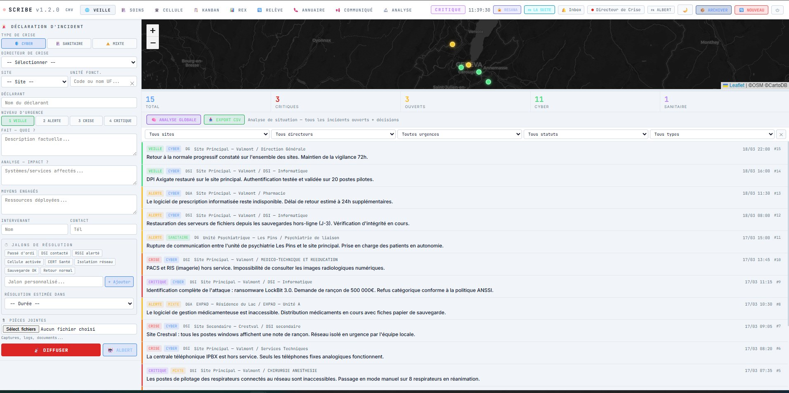 | 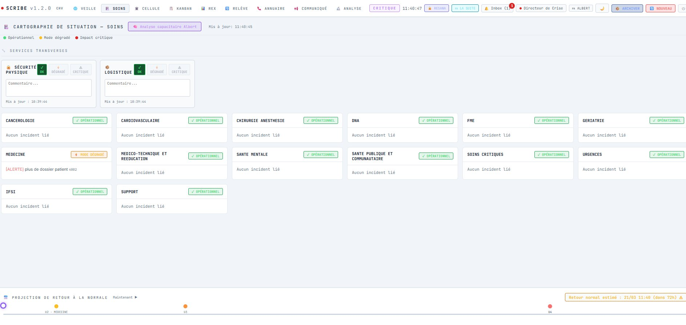 |

| Onglet CELLULE — Salle de crise | Onglet KANBAN — Tableau opérationnel |
|---|---|
| 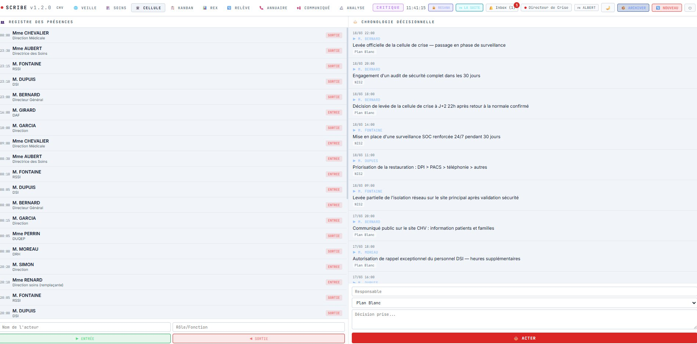 | 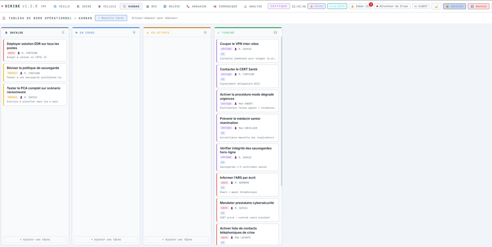 |

| Onglet CAPACITÉ — Déclaration de service | Onglet RELÈVE — Passation d'équipe |
|---|---|
| 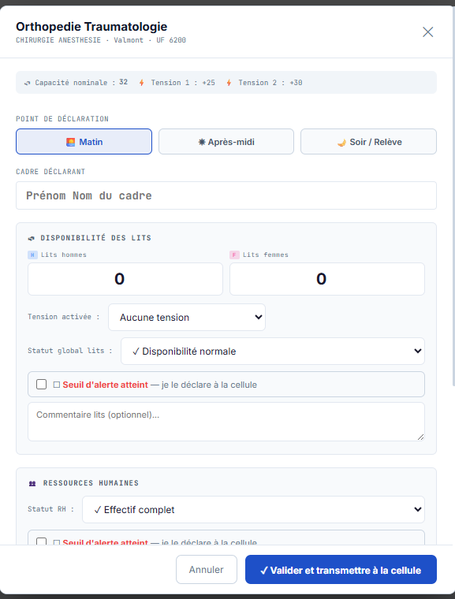 | 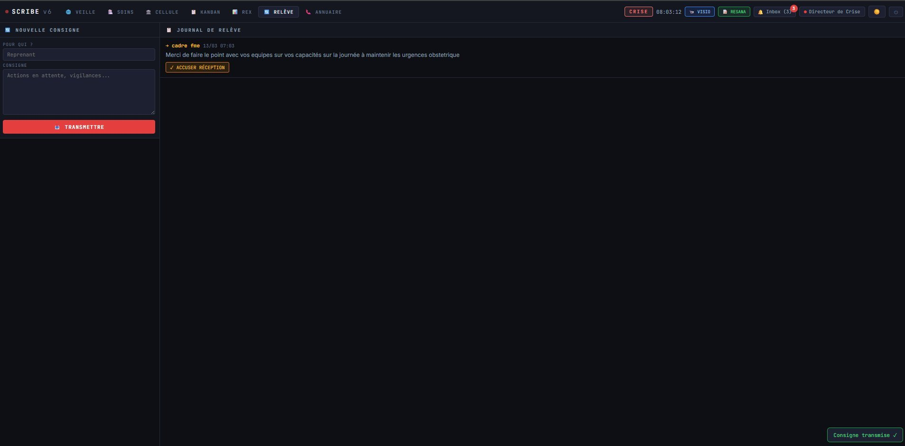 |

| Onglet COMMUNIQUÉ — Statut public | Onglet ANNUAIRE — Contacts d'urgence |
|---|---|
| 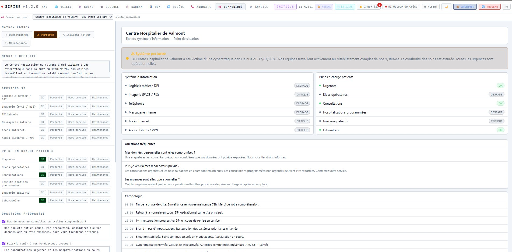 | 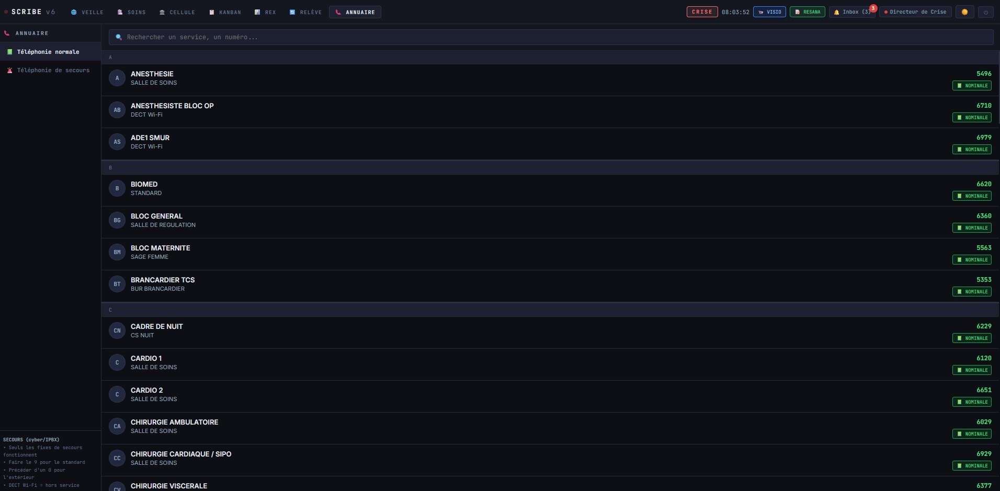 |

| Collecteur territorial — Supervision | Collecteur territorial — Cartographie |
|---|---|
| 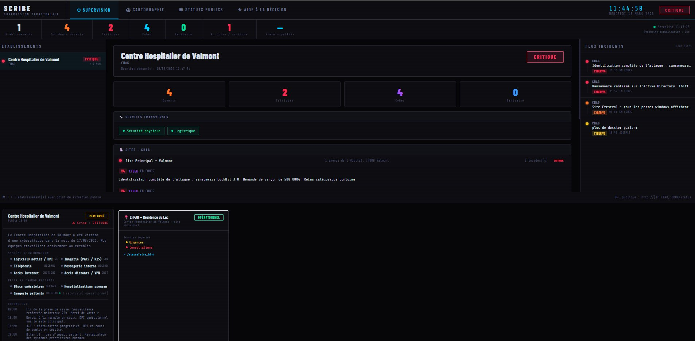 | 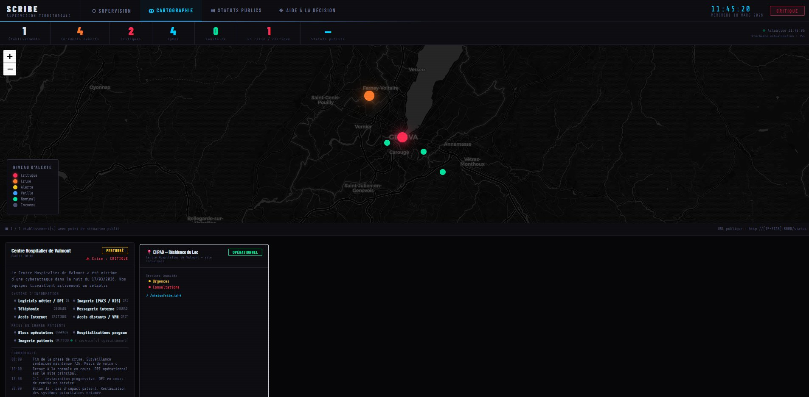 |

| Analyse de gestion des crises | REX — Retour d'expérience post-crise |
|---|---|
| 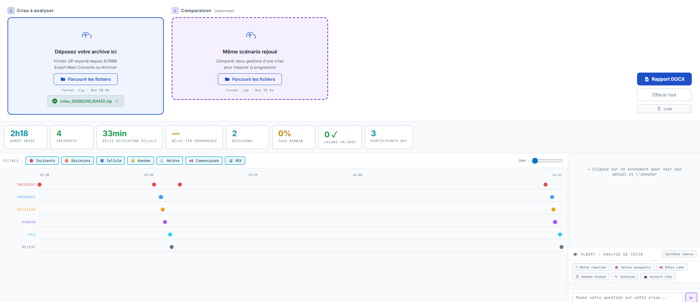 | 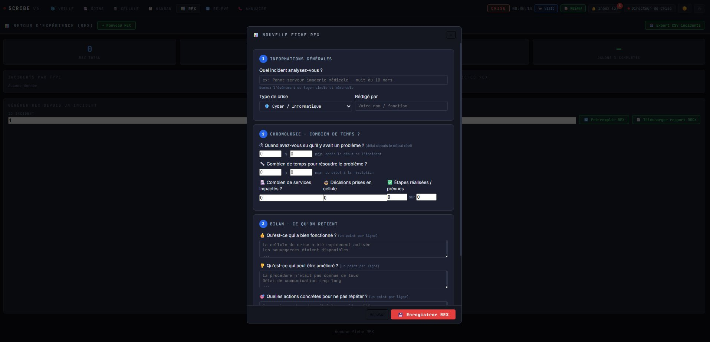 |

| Gestion capacitaire des lits et RH |
|---|
| 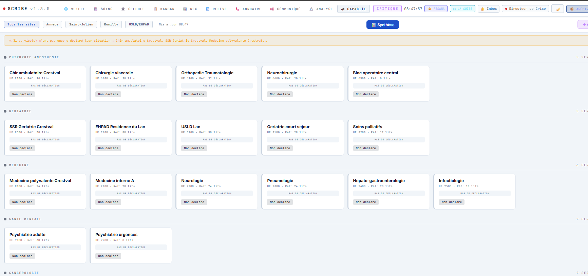 |

---

### 🎮 Mode exercice (v2.0) — captures

> Le mode exercice de SCRIBE permet de faire jouer des scénarios de crise réalistes à des équipes hospitalières, sur plusieurs sites simultanément, avec une console animateur dédiée.

**Console animateur — Supervision en temps réel des sites participants**

L'animateur voit l'état de chaque instance joueur, peut afficher leur tableau de bord en un clic via SSO, et superviser les statuts publics que chaque site choisit de publier vers l'extérieur (fonction stratégique pédagogique).

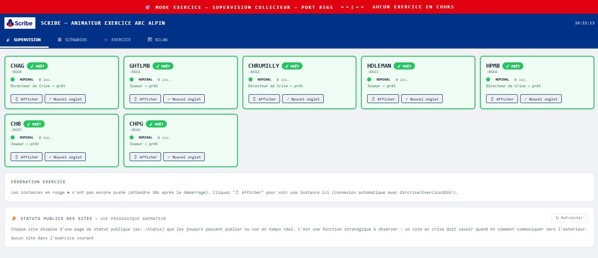

**Bibliothèque de scénarios prêts à jouer**

Les scénarios couvrent différentes catégories (sanitaire, cyber, mixte) avec niveaux de difficulté, durée, nombre de stimuli et nombre de sites participants.

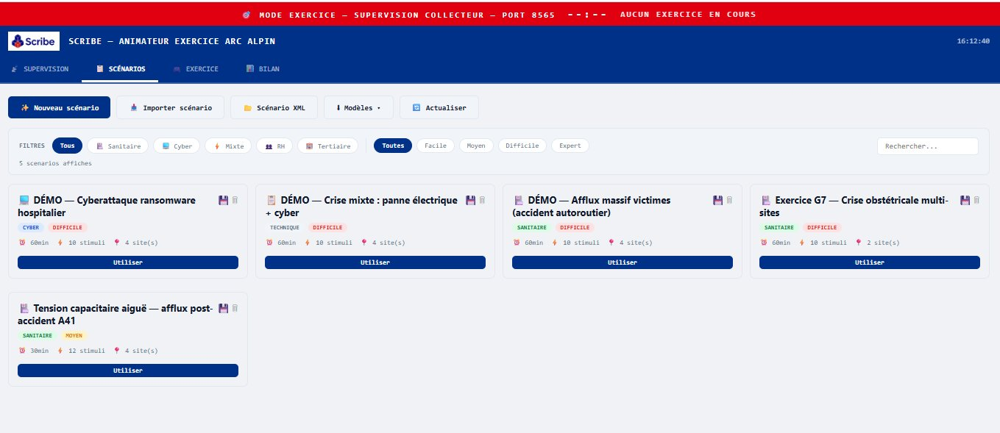

**Création d'un scénario — formulaire guidé**

Création assistée d'un nouveau scénario d'exercice : identité, contexte clinique, durée jouée vs durée simulée (avec compression temporelle), type de crise, complexité, stimuli externes (SAMU, ARS, Médias…), valeurs métiers à travailler, services supports impliqués et sites participants. Génération IA optionnelle pour produire automatiquement la chronologie de stimuli.

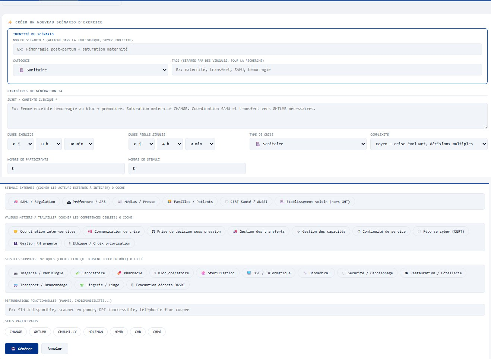

**Détail d'un scénario — contexte, objectifs et déroulé**

Vue détaillée d'un scénario : caractéristiques (durée jeu, durée simulée, compression, complexité, nombre de stimuli, nombre d'établissements), objectifs pédagogiques explicites, et chronologie complète des 12 stimuli avec horodatage relatif (T+0, T+3, T+5…), type (message / capacite / brancardage / incident) et destinataire.

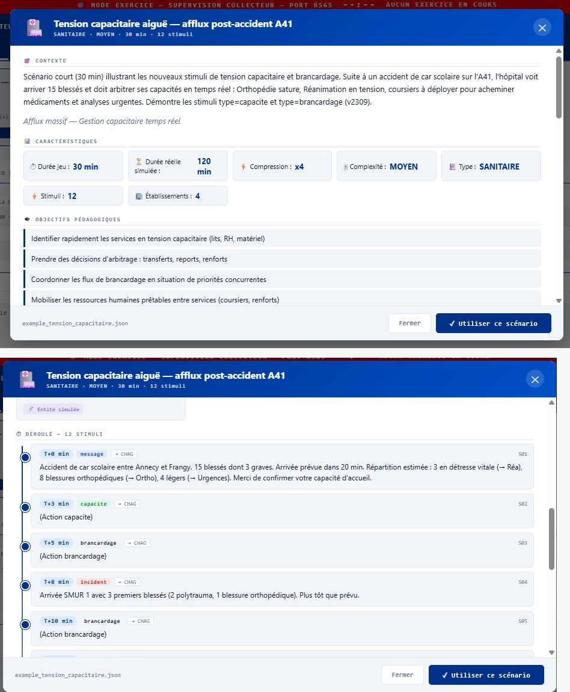

---

### Démarrage rapide

```bash
# Linux / macOS
pip install -r requirements.txt
python setup.py          # menu interactif : démo / config personnalisée
# → http://localhost:8000  (login: dircrise / Scribe2026!)
```

```bat
# Windows — double-clic sur SETUP.bat ou depuis PowerShell :
.\SETUP.bat
# Choisir [1] pour la démo avec scénario ransomware pré-rempli
```

```bash
# Docker
git clone https://github.com/nocomp/scribe
cd scribe && git checkout beta
docker compose up -d
# → http://localhost:8000   login: dircrise / Scribe2026!
```

---

### Fonctionnalités v2.0

> **Nouveautés v2.0** (par rapport à v1.5) :
> - 📱 **Vue mobile autonome** `/m` — accès terrain optimisé pour les déplacements inter-établissements
> - 🔐 **MFA TOTP** — double authentification activable depuis l'admin (compatible Google Authenticator, Aegis, 2FAS, Microsoft Authenticator…), 10 codes de backup à usage unique
> - 🎮 **Mode exercice complet** — collecteur dédié avec interface animateur, scénarios injectables, multi-sites simultanés, SSO animateur → joueur
> - 📡 **Statuts publics** supervisés en temps réel par l'animateur d'exercice (vue pédagogique)
> - 📦 **Archivage→scénario rejouable** — toute crise réelle archivée peut être transformée en scénario d'exercice automatiquement
> - 🌍 **Multi-langue** — interface disponible en 8 langues (FR, EN, DE, ES, IT, NL, PL, PT) avec sélecteur admin
> - 📨 **Messages multi-destinataires** avec fan-out automatique vers les sites engagés dans l'exercice
> - 🛏️ **Stimuli capacité multi-unités** — sélection multiple d'unités fonctionnelles dans un seul stimulus
> - 🏷️ **Badges de notification** sur tous les onglets (incidents, capacité, brancardage, messages)

---

#### 🌐 VEILLE — Main courante incidents

- Déclaration d'incident : CYBER / SANITAIRE / MIXTE, niveaux 1 (VEILLE) à 4 (CRITIQUE)
- Jalons de résolution prédéfinis (DSI contacté, CERT Santé, Isolation réseau, Sauvegarde OK…) + jalons personnalisés
- Analyse IA par Albert (DINUM) — cyber ou sanitaire selon le type d'incident
- **Analyse globale** : Albert analyse tous les incidents ouverts + décisions cellule en une requête
- Timeline interactive avec projection de retour à la normale
- Export CSV, export main courante complète (tous modules)
- Filtres multi-critères : site, directeur, urgence, statut, type

#### 🏥 SOINS — Cartographie des pôles

- Vue par pôle clinique avec statut : OPÉRATIONNEL / MODE DÉGRADÉ / IMPACT CRITIQUE
- **Coloration automatique** selon les incidents ouverts rattachés au pôle (via code UF ou mots-clés)
- **Coloration capacitaire** : si un cadre déclare une alerte dans CAPACITÉ, le pôle concerné se colore dans SOINS
- Analyse capacitaire Albert

#### 🏛️ CELLULE — Salle de crise

- Registre des présences horodaté (entrée/sortie, nom, rôle)
- Chronologie décisionnelle avec base réglementaire (Plan Blanc, NIS2, ORSAN…)

#### 📋 KANBAN — Tableau opérationnel

- 4 colonnes : BACKLOG / EN COURS / EN ATTENTE / TERMINÉ
- Drag & drop entre colonnes, priorités, assignees, dates d'échéance, liens incidents

#### 📊 REX — Retour d'expérience

- Formulaire en langage opérationnel (non-technicien), 3 étapes
- Pré-remplissage automatique par Albert depuis les données de l'incident
- Export DOCX rapport de clôture

#### 🔄 RELÈVE — Passation de consignes

- Journal horodaté, **accusé de réception nominatif** (prénom + horodatage tracés)

#### 📞 ANNUAIRE — Répertoire de crise

- Contacts nominaux et de secours (téléphonie cyber/IPBX)
- Bascule automatique vers numéros de secours en cas de crise

#### 📢 COMMUNIQUÉ — Statut public multi-sites

- Niveaux : OPÉRATIONNEL / PERTURBÉ / DÉGRADÉ / ALERTE / CRITIQUE
- Page `/status?site_id=N` accessible sans authentification
- Push vers le collecteur territorial

#### 🚑 TRANSFERTS — Gestion des patients *(v2.0)*

- Suivi des transferts patients entre sites : EN PRÉPARATION / EN COURS / ARRIVÉ / ANNULÉ
- Formulaire nominatif (données patients restant dans l'établissement, non remontées au collecteur)
- Rédacteur pré-rempli avec l'utilisateur connecté
- Filtres par statut et par site

#### 🛏️ CAPACITÉ — Gestion capacitaire des lits

**Usage en mode nominal (hors crise)** :

- Les cadres de service déclarent leur situation 3 fois/jour (matin, après-midi, soir/relève)
- Formulaire rapide (< 2 min) : lits disponibles H/F/I, statut RH, statut matériel, commentaire
- Tableau de bord temps réel pour le directeur des soins

**Usage en mode crise** :

- Déclaration de seuil d'alerte → **création automatique d'un incident dans VEILLE**
- Impact visuel immédiat sur les cartes de pôles dans SOINS
- Push vers le collecteur territorial GHT/ARS

#### 📡 INTER-GHT — Coordination territoriale *(v2.0)*

- **Déclarations de situation** : signalement d'une tension ou crise à tous les GHTs partenaires, visible dans le collecteur territorial et **sur toutes les instances connectées**
- **Demandes inter-GHT** : sollicitation d'un autre établissement (transfert patient, renfort RH, matériel, ressources) — émetteur pré-rempli depuis la session courante, destinataire par menu déroulant (Tous / GHT individuel)
- **Messages collecteur** : réception des messages broadcast envoyés depuis l'interface du collecteur territorial
- Propagation en temps réel via le mécanisme de push fédération (cycle 30s)
- Badge `📡 NomGHT` sur les demandes reçues des partenaires

#### ✉️ MESSAGERIE — Communication interne et inter-GHT

- Messagerie interne : envoi à n'importe quel utilisateur de l'établissement, filtrage par site/service
- **Messagerie inter-GHT** : envoi via le collecteur territorial vers un GHT spécifique ou tous les GHTs
- Menu destinataire unifié : correspondants locaux + groupe Inter-GHT dans le même select

#### 🔬 ANALYSE — Debriefing de crise

- Chargement ZIP d'archive par glisser-déposer (JSZip 3.10.1 embarqué — 100% hors-ligne)
- **8 métriques automatiques** : durée crise, délai activation cellule, délai communication publique, nb incidents, nb décisions, taux kanban, jalons validés, participants max
- **Frise chronologique interactive** : 7 catégories (incidents, décisions, cellule, kanban, relève, communiqués, REX + déclarations capacitaires)
- Mode comparaison : deux archives côte à côte
- Export rapport DOCX

#### 📦 Gestion de fin de crise

- **Bouton ARCHIVER** : crée un ZIP horodaté `archives/crise_YYYYMMDD_HHMMSS.zip`
- **Bouton NOUVEAU** : remet le tableau de bord à zéro (double confirmation requise)
- **Génération scénario rejouable** *(v2.0)* : checkbox à l'archivage qui transforme la crise vécue en scénario JSON injectable en mode exercice

#### 📱 Vue mobile autonome `/m` *(v2.0)*

Vue dédiée aux usages terrain (RSSI en déplacement entre établissements, directeur de crise mobile, cadre de garde) :

- Accessible sur n'importe quelle instance via `http://votre-instance/m`
- 5 écrans en navigation bottom-tab : Accueil (KPIs), Incidents, Messages, Capacité, Profil
- Cache localStorage : affiche le dernier état même hors réseau, bandeau d'alerte si offline
- Pull-to-refresh, auto-refresh 60s
- Compatible iOS (safe-area, notch) et Android
- SSO via `?autotoken=XXX` depuis la console animateur

> *Cas d'usage* : tu quittes un site en voiture, tu gardes `/m` ouvert sur le téléphone, tu vois les incidents arriver en temps réel, tu tapes pour ouvrir le détail. Même si le réseau coupe dans un tunnel, le cache garde la dernière vue.

#### 🔐 MFA TOTP *(v2.0)*

Double authentification activable depuis l'admin (Section CONFIGURATION → 🔐 Sécurité MFA) :

- **Setup** : QR code à scanner avec une app d'authentification + saisie d'un code à 6 chiffres pour valider
- **Apps compatibles** : Google Authenticator, Aegis, 2FAS, Microsoft Authenticator, FreeOTP, 1Password, Bitwarden, KeePassXC…
- **10 codes de backup** générés à l'activation (à usage unique chacun) — téléchargeables en `.txt`
- **Régénération** des codes possible à tout moment (avec code TOTP actuel)
- **Désactivation** par l'utilisateur (mot de passe requis) ou par l'admin (cas de perte de téléphone)
- **Login phase 2** automatique : si le compte a MFA activé, le login bascule en mode prompt code TOTP après mot de passe

#### 🎮 Mode exercice complet *(v2.0)*

Architecture dédiée à la formation et aux exercices de gestion de crise :

- **Collecteur exercice** sur port dédié avec interface animateur (scénarios, supervision, contrôle)
- **Scénarios injectables** : afflux post-accident, ransomware, panne électrique, événement sanitaire (extensibles)
- **Stimuli scriptés** ou **manuels** : messages externes, incidents, transferts, décisions cellule, tensions capacitaires multi-unités, brancardages avec presets
- **SSO animateur → joueur** : un clic ouvre l'instance d'un site sans login manuel
- **Statuts publics supervisés** : l'animateur voit en temps réel quels joueurs publient leur statut public et avec quel message (vue pédagogique)
- **Archivage→Rejouable** : toute crise réelle peut être archivée puis rejouée comme scénario d'exercice
- **Compression temporelle** : un exercice de 6h peut être joué en 1h30 grâce à la compression réglable

---

### Architecture

```
scribe/
├── SETUP.bat                     ← Script de démarrage interactif (Windows)
├── setup.py                      ← Script de démarrage interactif (Linux/macOS) ★ v1.5.0
├── README.md                     ← Documentation bilingue FR/EN
├── screenshots/                  ← Captures d'écran
├── main.py                       ← Point d'entrée FastAPI
├── config.xml                    ← Configuration établissement (à personnaliser)
├── setup_demo1.py                ← Démo CHV Valmont (5 sites, 106 UF)
├── setup_demo2.py                ← Démo CSBM Montrelay
├── seed_demo_crise.py            ← Scénario ransomware LockBit 48h
├── import_config_xlsx.py         ← Import UF depuis export FICOM (.xlsx)
├── collecteur/                   ← Superviseur territorial (port 9000)
│   ├── collecteur.py             ← FastAPI mono-fichier
│   └── setup_collecteur_auth.py  ← Login/mdp interface web
└── app/
    ├── static/index.html         ← SPA complète
    ├── lang/                     ← i18n : fr en de es it nl pl pt
    └── api/
        ├── sitrep.py             ← Incidents (CRUD, jalons, PJ)
        ├── cellule.py            ← Présences + décisions
        ├── tasks.py              ← Kanban
        ├── releve.py             ← Consignes + accusés nominatifs
        ├── rex.py                ← Retour d'expérience
        ├── rapport.py            ← Export DOCX, archivage, fin de crise
        ├── albert.py             ← Endpoints IA
        ├── ai_router.py          ← Abstraction 7 fournisseurs IA
        ├── capacite.py           ← Gestion capacitaire lits/RH/matériel
        ├── cartographie.py       ← UF, pôles, mapping UF→pôle
        ├── federation.py         ← Push collecteur + inter-GHT ★ v1.5.0
        ├── transferts.py         ← Transferts patients ★ v1.5.0
        ├── v140.py               ← Déclarations situation + demandes inter-GHT ★ v1.5.0
        └── status_page.py        ← Communiqués publics
```

---

### Configuration (`config.xml`)

```xml
<?xml version="1.0" encoding="UTF-8"?>
<scribe>
  <etablissement>
    <nom>Centre Hospitalier de Valmont</nom>
    <sigle>CHV</sigle>
    <finess>000000001</finess>
  </etablissement>

  <admin>
    <login>dircrise</login>
    <password>MotDePasse!</password>
    <nom_affiche>Directeur de Crise</nom_affiche>
  </admin>

  <sites>
    <site>
      <nom>Site Principal — Valmont</nom>
      <adresse>1 avenue de l'Hôpital, 74000 Valmont</adresse>
      <latitude>46.2012</latitude>
      <longitude>6.1445</longitude>
      <telephone_garde>04 50 00 00 01</telephone_garde>
    </site>
  </sites>

  <!-- Langue interface : fr en de es it nl pl pt -->
  <langue>fr</langue>

  <ia>
    <!-- albert | openai | anthropic | gemini | mistral | ollama | openai_compat -->
    <fournisseur>albert</fournisseur>
    <cle_api>sk-...</cle_api>
    <modele>mistralai/Ministral-3-8B-Instruct-2512</modele>
    <url_base>https://albert.api.etalab.gouv.fr/v1/chat/completions</url_base>
  </ia>

  <federation>
    <enabled>true</enabled>
    <collecteur_url>http://IP-COLLECTEUR:9000/api/push</collecteur_url>
    <token>TOKEN_16_CHARS_MIN</token>
    <intervalle_secondes>30</intervalle_secondes>
    <share_details>true</share_details>
    <share_min_urgency>1</share_min_urgency>
  </federation>
</scribe>
```

---

### IA — 7 fournisseurs supportés

| Fournisseur | `<fournisseur>` | Notes |
|---|---|---|
| **Albert (DINUM)** | `albert` | ✅ Recommandé ES publics français — souverain |
| **Ollama** | `ollama` | 100% local, hors-ligne |
| OpenAI | `openai` | GPT-4 |
| Anthropic | `anthropic` | Claude |
| Mistral | `mistral` | api.mistral.ai |
| Gemini | `gemini` | Google |
| Compatible OpenAI | `openai_compat` | LM Studio, vLLM, Jan |

Changement de fournisseur sans modification de code — uniquement dans `config.xml`.

---

### Collecteur territorial

Application indépendante (port 9000) agrégeant les remontées de plusieurs établissements.

**Routes de push** :

- `/api/push` → état de crise (incidents, KPIs, niveaux, **déclarations de situation**, **demandes inter-GHT**) — destinataire : CERT Santé / GHT
- `/api/push-capacite` → état sanitaire (lits, RH, matériel) — destinataire : ARS, GHT
- `/api/messages` → messagerie inter-établissements
- `/api/declarations` → agrégation des déclarations de situation de tous les GHTs ★ v1.5.0
- `/api/demandes` → agrégation des demandes inter-GHT actives ★ v1.5.0

```bash
cd collecteur/
pip install -r collecteur_requirements.txt
python setup_collecteur_auth.py    # optionnel — login/mdp
python collecteur.py
# → http://localhost:9000

# Enregistrer un établissement
curl -X POST http://localhost:9000/api/admin/tokens \
  -H "Authorization: Bearer TOKEN_ADMIN" \
  -H "Content-Type: application/json" \
  -d '{"sigle":"MONCH","token":"TOKEN_ETABLISSEMENT"}'
```

---

### Déploiement — un seul établissement

```bash
# Prérequis Ubuntu/Debian
sudo apt install python3 python3-pip

# Installation
git clone https://github.com/nocomp/scribe
cd scribe && git checkout beta
pip install -r requirements.txt

# Configuration et démarrage interactif
python setup.py
# → Choisir [1] démo ou [4] config personnalisée depuis config.xml
# → http://localhost:8000
```

---

### Déploiement — multi-établissements avec supervision

```bash
# Structure recommandée : un dossier par instance
/opt/scribe-site1/    ← clone du repo, DB site1, config site1
/opt/scribe-site2/    ← clone du repo, DB site2, config site2
/opt/scribe-coll/     ← dossier collecteur

# 1. Démarrer le collecteur
cd /opt/scribe-coll/collecteur
pip install -r collecteur_requirements.txt
python setup_collecteur_auth.py
COLLECTEUR_PORT=9000 python collecteur.py &

# 2. Configurer chaque établissement (config.xml avec token unique)
# Dans chaque config.xml :
#   <collecteur_url>http://localhost:9000/api/push</collecteur_url>
#   <token>TOKEN_UNIQUE_ETABLISSEMENT</token>

# 3. Initialiser et démarrer chaque instance
cd /opt/scribe-site1
python setup.py config_site1.xml   # initialise la DB
SCRIBE_PORT=8001 DATABASE_URL=sqlite:///scribe_site1.db python main.py &

cd /opt/scribe-site2
python setup.py config_site2.xml
SCRIBE_PORT=8002 DATABASE_URL=sqlite:///scribe_site2.db python main.py &

# 4. Accepter chaque établissement dans le collecteur
# → http://localhost:9000 → ⏳ EN ATTENTE → ✓ ACCEPTER
```

**Avec `lancer_exercice.sh`** (script fourni pour démo multi-sites avec scénarios injectables) :

```bash
bash lancer_exercice.sh    # Linux/Mac : lance le collecteur exercice + 6 instances multi-sites
START-EXERCICE.bat         # Windows : équivalent
```

Le mode exercice fournit en plus :
- Un **collecteur exercice** dédié avec interface animateur
- Des **scénarios injectables** (afflux post-accident, ransomware, panne électrique, événement sanitaire)
- Une **bibliothèque de stimuli** : messages, incidents, transferts, décisions, tensions capacitaires, brancardages
- Le **rejouage de scénarios** : une crise vécue peut être archivée et transformée automatiquement en scénario rejouable

---

### Déploiement production (Linux systemd)

```ini
[Unit]
Description=SCRIBE Crisis Management — Site Principal
After=network.target

[Service]
User=scribe
WorkingDirectory=/opt/scribe
Environment="SCRIBE_PORT=8000"
Environment="DATABASE_URL=sqlite:////opt/scribe/data/scribe.db"
Environment="SCRIBE_CONFIG_JS=/opt/scribe/data/config.js"
ExecStart=/usr/bin/python3 main.py
Restart=always
RestartSec=5

[Install]
WantedBy=multi-user.target
```

```bash
sudo systemctl enable scribe && sudo systemctl start scribe
```

---

### 🐳 Déploiement Docker

```bash
# Mode démo
docker compose up -d
# → http://localhost:8000   login: dircrise / Scribe2026!

# Avec config personnalisée
docker compose up -d  # décommenter le volume config.xml dans docker-compose.yml
```

| Variable | Défaut | Description |
|---|---|---|
| `SCRIBE_IA_PROVIDER` | `albert` | Fournisseur IA |
| `SCRIBE_IA_KEY` | — | Clé API IA |
| `SCRIBE_PORT` | `8000` | Port d'écoute |
| `LOG_LEVEL` | `info` | Niveau de log |

---

### Conformité réglementaire

| Référentiel | Couverture |
|---|---|
| **NIS2** | Traçabilité décisions, jalons CERT Santé, chronologie, archivage |
| **Plan Blanc** | Activation cellule, registre présences, diffusion communiqués |
| **CERT Santé** | Jalon dédié, signalement intégré dans l'annuaire secours |
| **HDS / RGPD** | Déploiement local, zéro cloud obligatoire, données souveraines |
| **ORSAN** | Base réglementaire des décisions cellule |

---

### Scénario de démonstration

`seed_demo_crise.py` génère un scénario **ransomware LockBit complet (48h)** :

- 15 incidents sur 5 sites, 8 pôles cliniques
- 22 décisions actées (Plan Blanc, NIS2, ORSAN)
- 20 tâches kanban (dont 11 TERMINÉES)
- 10 consignes de relève avec accusés nominatifs
- 5 fiches REX, 2 communiqués publics multi-sites

---

## 🇬🇧 SCRIBE — Hospital Crisis Management Log

SCRIBE is an open-source **hospital crisis management and bed capacity monitoring platform** developed by the CISO of Centre Hospitalier Annecy-Genevois (CHAG). It provides a complete digital crisis log, real-time capacity tracking, a multi-facility territorial collector, and an AI-powered post-crisis debriefing module.

**Dual use** — both in normal operations and during crises.
**Designed for non-technical staff** — no cloud, no LDAP, runs fully offline.

---

### Quick Start

```bash
# Linux / macOS
pip install -r requirements.txt
python setup.py       # interactive menu: demo / custom config
# → http://localhost:8000  (login: dircrise / Scribe2026!)
```

```bat
# Windows
.\SETUP.bat
# Choose [1] for the ransomware demo
```

```bash
# Docker
git clone https://github.com/nocomp/scribe && cd scribe && git checkout beta
docker compose up -d
# → http://localhost:8000
```

---

### Features v2.0

#### 🌐 WATCH — Incident Log
Incident declaration (CYBER / HEALTH / MIXED, levels 1–4), predefined milestones, AI analysis (Albert DINUM), interactive timeline, CSV export.

#### 🏥 CARE — Capacity Mapping
14 clinical department cards with automatic status coloring driven by incidents and capacity alerts.

#### 🏛️ CELL — Crisis Room
Timestamped attendance register, decision log with regulatory basis.

#### 📋 KANBAN — Operational Board
4-column board with drag & drop, priorities, assignees, due dates, incident links.

#### 📊 REX — Experience Feedback
Plain-language form, Albert auto-fill, DOCX export.

#### 🔄 HANDOVER — Shift Handover
Timestamped log with **named acknowledgement** (first name + timestamp).

#### 📞 DIRECTORY — Crisis Directory
Standard and emergency contacts, automatic telephone failover.

#### 📢 BULLETIN — Public Status
Multi-site independent management, public page without authentication.

#### 🚑 TRANSFERS — Patient Management *(v2.0)*
Patient transfer tracking between sites: PREPARING / IN PROGRESS / ARRIVED / CANCELLED. Patient data stays local and never reaches the collector.

#### 🛏️ CAPACITY — Bed Capacity Management
3×/day nurse manager declarations (M/F/N beds, HR, equipment), real-time director dashboard, automatic incident creation on alert threshold, push to ARS/GHT collector.

#### 📡 INTER-GHT — Territorial Coordination *(v2.0)*
- **Situation declarations**: broadcast a tension or crisis to all partner GHTs — visible on all connected instances in real time
- **Inter-GHT requests**: solicit another facility (patient transfer, HR, equipment, resources) — sender pre-filled from active session, recipient via dropdown (All / individual GHT)
- **Collector messages**: receive broadcast messages sent from the territorial collector
- Real-time propagation via federation push (30s cycle)

#### ✉️ MESSAGING — Internal & Inter-GHT
Internal messaging to any facility user + inter-GHT messaging via collector (broadcast or targeted). Unified recipient select combining local contacts and inter-GHT groups.

#### 🔬 ANALYSIS — Crisis Debrief
ZIP archive upload (offline), 8 automatic metrics, interactive timeline of all activities, comparison mode, Albert analysis, DOCX report export.

#### 📦 End-of-Crisis Management
**ARCHIVE** button (timestamped ZIP) + **NEW** button (dashboard reset with double confirmation).

---

### Single-facility Deployment

```bash
git clone https://github.com/nocomp/scribe
cd scribe && git checkout beta
pip install -r requirements.txt
python setup.py
# → http://localhost:8000
```

### Multi-facility Deployment with Supervision

```bash
# Start collector first
cd collecteur/ && pip install -r collecteur_requirements.txt
python collecteur.py &   # → http://localhost:9000

# Configure each facility in config.xml:
# <collecteur_url>http://localhost:9000/api/push</collecteur_url>
# <token>UNIQUE_TOKEN_PER_FACILITY</token>

# Initialize and start each instance
SCRIBE_PORT=8001 DATABASE_URL=sqlite:///site1.db python main.py &
SCRIBE_PORT=8002 DATABASE_URL=sqlite:///site2.db python main.py &

# Accept each facility in collector UI: http://localhost:9000
# → ⏳ PENDING → ✓ ACCEPT
```

---

### AI — 7 supported providers

| Provider | Config | Notes |
|---|---|---|
| **Albert (DINUM)** | `albert` | ✅ Recommended for French public health — sovereign |
| **Ollama** | `ollama` | 100% local, fully offline |
| OpenAI | `openai` | GPT-4 |
| Anthropic | `anthropic` | Claude |
| Mistral | `mistral` | api.mistral.ai |
| Gemini | `gemini` | Google |
| OpenAI-compatible | `openai_compat` | LM Studio, vLLM, Jan |

---

### Regulatory Compliance

| Framework | Coverage |
|---|---|
| **NIS2** | Decision traceability, CERT Santé milestones, timeline, archiving |
| **White Plan** | Cell activation, attendance register, communications |
| **CERT Santé** | Dedicated milestone, integrated reporting |
| **HDS / GDPR** | Local deployment, zero mandatory cloud, sovereign data |
| **ORSAN** | Regulatory basis for crisis room decisions |

---

## Changelog

### v1.5.0 beta (March 2026)

- **NEW: INTER-GHT tab** — situation declarations, inter-GHT requests (sender auto-filled, dropdown recipient), collector messages. All propagated in real time via federation push.
- **NEW: TRANSFERS tab** — patient transfer management between sites, patient data stays local
- **NEW: Unified inter-GHT messaging** — send to individual GHT or broadcast from the standard messaging compose window
- **NEW: `setup.py` interactive menu** (Linux/macOS equivalent of SETUP.bat) — demo / custom config / Docker
- **FIX: `federation.py` double router** — all `/api/v1/federation/*` routes returning 404 (double `APIRouter()` declaration overwriting the first)
- **FIX: logout** — `apiFetch` now shows login overlay on any 401, whether or not a token is active; `doLogout` forces `display:flex!important` on overlay
- **FIX: user menu** — `.header-right` was missing `position:relative`, causing dropdown to render off-screen
- **FIX: msgFilterUsers** — was referencing `allData` (analysis module variable, undefined in messaging context); now uses `_annInterGHT`
- **FIX: race condition** — `ightLoadDecl/Dem` retry after 800ms if `authToken` not yet assigned at tab open

### v1.3.0

- **NEW: CAPACITY tab** — bed capacity management with nurse manager declarations, alert thresholds, automatic incident creation
- **NEW: Albert CAPACITY** — AI analysis of capacity situation
- **NEW: Territorial collector capacity route** — `/api/push-capacite`
- Fix: CARE tab coloring, capacity declarations in archive ZIP
- Interactive `SETUP.bat` for Windows

### v1.2.0

- ANALYSIS tab: offline ZIP debrief, 8 metrics, interactive timeline, comparison mode, DOCX export
- JSZip 3.10.1 embedded inline (offline)

### v1.1.1

- Named acknowledgement in HANDOVER
- Full activity log CSV export
- Collector login/password protection
- NEW CRISIS button: ZIP archive + dashboard reset

### v1.1.0

- Internationalisation: 8 European languages
- Collector: distinct GPS markers per geographic site

---

## Contributors

- [@nocomp](https://github.com/nocomp) — RSSI CHAG — project lead
- [@charles-chu-lyon](https://github.com/charles-chu-lyon) — CHU Lyon — PR #1 ai_router fix
- [@Elched](https://github.com/Elched) — SOC-HCL — PR #2-#4 Dockerfile, ai_router fix

---

## License

MIT — Free to use, modify and distribute.
Developed by and for French public healthcare facilities.

**Repository**: https://github.com/nocomp/scribe  
**Branch**: `beta`  
**Version**: 1.5.0 beta — March 2026
